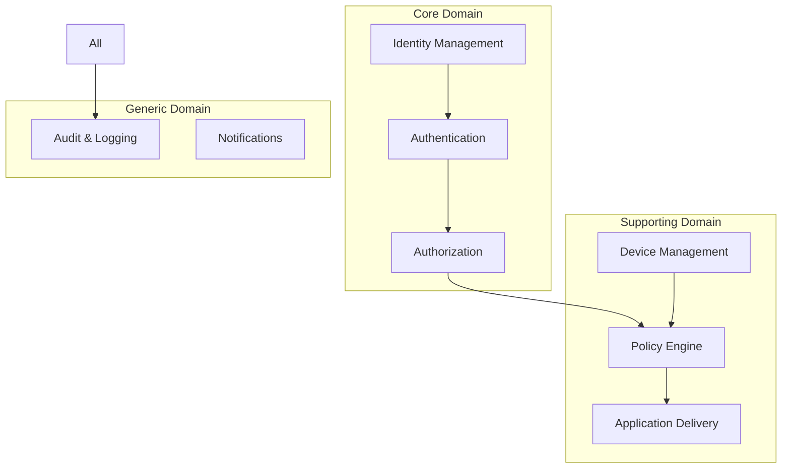
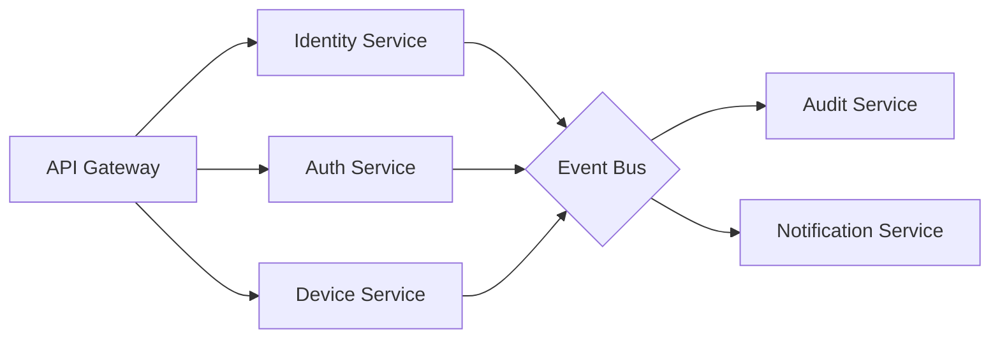
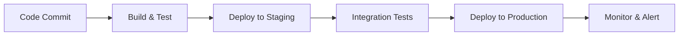

# 🏗️ OpenDirectory Architecture

## Domain-Driven Design (DDD) & Microservices Architecture

---

## 📚 Table of Contents

1. [Strategic Design](#strategic-design)
2. [Tactical Design](#tactical-design)
3. [Bounded Contexts](#bounded-contexts)
4. [Microservices](#microservices)
5. [Event Flow](#event-flow)
6. [Data Architecture](#data-architecture)
7. [API Design](#api-design)

---

## 🎯 Strategic Design

### Domain Model



### Ubiquitous Language

- **Principal**: Any entity that can be authenticated (User, Service, Device)
- **Identity**: Unique representation of a principal
- **Tenant**: Isolated organizational unit
- **Policy**: Set of rules governing access and configuration
- **Claim**: Assertion about a principal
- **Role**: Collection of permissions
- **Device**: Any managed endpoint (Computer, Mobile, IoT)

---

## 🔧 Tactical Design

### Building Blocks

#### Entities
```typescript
// Example: User Entity
export class User {
    constructor(
        private readonly id: UserId,
        private username: Username,
        private email: Email,
        private roles: Role[],
        private metadata: UserMetadata
    ) {}
    
    // Business logic here
    assignRole(role: Role): void { /* ... */ }
    changeEmail(email: Email): void { /* ... */ }
}
```

#### Value Objects
```typescript
// Example: Email Value Object
export class Email {
    constructor(private readonly value: string) {
        if (!this.isValid(value)) {
            throw new InvalidEmailError(value);
        }
    }
    
    private isValid(email: string): boolean {
        return /^[^\s@]+@[^\s@]+\.[^\s@]+$/.test(email);
    }
    
    toString(): string {
        return this.value;
    }
}
```

#### Aggregates
```typescript
// Example: Organization Aggregate
export class Organization {
    private users: User[] = [];
    private groups: Group[] = [];
    private policies: Policy[] = [];
    
    constructor(
        private readonly id: OrganizationId,
        private name: OrganizationName
    ) {}
    
    addUser(user: User): void {
        // Invariant: User email must be unique
        if (this.users.some(u => u.email.equals(user.email))) {
            throw new DuplicateUserError();
        }
        this.users.push(user);
        this.emit(new UserAddedEvent(this.id, user.id));
    }
}
```

#### Domain Events
```typescript
// Example: Domain Event
export class UserCreatedEvent implements DomainEvent {
    constructor(
        public readonly aggregateId: string,
        public readonly userId: string,
        public readonly username: string,
        public readonly email: string,
        public readonly occurredAt: Date = new Date()
    ) {}
}
```

---

## 🗺️ Bounded Contexts

### 1. Identity Context

**Responsibility**: Managing users, groups, and organizational structures

**Core Concepts**:
- User Management
- Group Hierarchies  
- Organization Structure
- Profile Management

**Aggregates**:
- User
- Group
- Organization

**Services**:
- UserService
- GroupService
- DirectoryService

### 2. Authentication Context

**Responsibility**: Verifying identity and managing sessions

**Core Concepts**:
- Login/Logout
- MFA/2FA
- Session Management
- Password Policies

**Aggregates**:
- AuthenticationSession
- Credential
- MfaDevice

**Services**:
- AuthenticationService
- SessionService
- MfaService

### 3. Authorization Context

**Responsibility**: Access control and permissions

**Core Concepts**:
- RBAC (Role-Based Access Control)
- ABAC (Attribute-Based Access Control)
- Permissions
- Claims

**Aggregates**:
- Role
- Permission
- AccessPolicy

**Services**:
- AuthorizationService
- RoleService
- PolicyEvaluationService

### 4. Device Management Context

**Responsibility**: Managing and monitoring devices

**Core Concepts**:
- Device Registration
- Inventory Management
- Compliance Checking
- Remote Control

**Aggregates**:
- Device
- DeviceGroup
- ComplianceProfile

**Services**:
- DeviceService
- ComplianceService
- RemoteManagementService

### 5. Policy Engine Context

**Responsibility**: Policy definition and enforcement

**Core Concepts**:
- Policy Templates
- Policy Assignment
- Compliance Rules
- Configuration Management

**Aggregates**:
- Policy
- PolicySet
- ComplianceRule

**Services**:
- PolicyService
- EnforcementService
- ComplianceService

### 6. Application Delivery Context

**Responsibility**: Software deployment and management

**Core Concepts**:
- Package Management
- Deployment Schedules
- Version Control
- License Management

**Aggregates**:
- Application
- DeploymentPackage
- License

**Services**:
- DeploymentService
- PackageService
- LicenseService

### 7. Audit Context

**Responsibility**: Logging, monitoring, and compliance

**Core Concepts**:
- Event Logging
- Audit Trail
- Compliance Reports
- Analytics

**Aggregates**:
- AuditLog
- ComplianceReport

**Services**:
- AuditService
- ReportingService
- AnalyticsService

---

## 🚀 Microservices

### Service Architecture Pattern

Each microservice follows:

```
service/
├── api/                 # API Layer (REST/GraphQL/gRPC)
├── application/        # Application Services (Use Cases)
├── domain/            # Domain Model (Entities, VOs, Events)
├── infrastructure/    # Infrastructure (DB, External Services)
└── presentation/      # Presentation (DTOs, Controllers)
```

### Service Definitions

#### Identity Service
```yaml
Name: identity-service
Port: 3001
Database: PostgreSQL (identity_db)
Cache: Redis
API: REST + GraphQL
Events: UserCreated, UserUpdated, GroupCreated
```

#### Authentication Service
```yaml
Name: auth-service
Port: 3002
Database: PostgreSQL (auth_db)
Cache: Redis (sessions)
API: REST
Events: LoginSucceeded, LoginFailed, SessionCreated
```

#### Device Service
```yaml
Name: device-service
Port: 3003
Database: MongoDB (devices)
Cache: Redis
API: REST + gRPC
Events: DeviceRegistered, DeviceUpdated, ComplianceChecked
```

### Inter-Service Communication



---

## 📊 Event Flow

### Event Sourcing Pattern

```typescript
// Event Store Interface
interface EventStore {
    save(event: DomainEvent): Promise<void>;
    getEvents(aggregateId: string): Promise<DomainEvent[]>;
    getEventsByType(eventType: string): Promise<DomainEvent[]>;
}

// Example Implementation
class UserAggregate extends AggregateRoot {
    apply(event: DomainEvent): void {
        switch(event.constructor) {
            case UserCreatedEvent:
                this.handleUserCreated(event as UserCreatedEvent);
                break;
            case EmailChangedEvent:
                this.handleEmailChanged(event as EmailChangedEvent);
                break;
        }
    }
}
```

### CQRS Implementation

```typescript
// Command Side
class CreateUserCommand {
    constructor(
        public readonly username: string,
        public readonly email: string,
        public readonly password: string
    ) {}
}

class CreateUserHandler {
    async handle(command: CreateUserCommand): Promise<void> {
        const user = User.create(
            command.username,
            command.email,
            command.password
        );
        await this.repository.save(user);
        await this.eventBus.publish(user.getUncommittedEvents());
    }
}

// Query Side
class GetUserQuery {
    constructor(public readonly userId: string) {}
}

class GetUserHandler {
    async handle(query: GetUserQuery): Promise<UserDTO> {
        return this.readModel.findById(query.userId);
    }
}
```

---

## 💾 Data Architecture

### Database Strategy

```yaml
Identity Context:
  Primary: PostgreSQL
  Read Model: PostgreSQL Views
  Cache: Redis

Authentication Context:
  Primary: PostgreSQL  
  Sessions: Redis
  Tokens: JWT + Redis Blacklist

Device Management Context:
  Primary: MongoDB (Document-based)
  Time-series: InfluxDB
  Cache: Redis

Audit Context:
  Primary: PostgreSQL (Partitioned)
  Analytics: ClickHouse
  Search: Elasticsearch
```

### Data Consistency

- **Within Aggregate**: Strong Consistency
- **Across Aggregates**: Eventual Consistency
- **Across Services**: Eventual Consistency via Events

---

## 🔌 API Design

### API Gateway Pattern

```typescript
// Kong/Traefik Configuration
{
  "routes": [
    {
      "path": "/api/v1/users",
      "service": "identity-service",
      "plugins": ["jwt-auth", "rate-limit", "cors"]
    },
    {
      "path": "/api/v1/auth",
      "service": "auth-service",
      "plugins": ["rate-limit", "cors"]
    },
    {
      "path": "/api/v1/devices", 
      "service": "device-service",
      "plugins": ["jwt-auth", "rate-limit", "cors"]
    }
  ]
}
```

### GraphQL Federation

```graphql
# Identity Service Schema
type User @key(fields: "id") {
  id: ID!
  username: String!
  email: String!
  roles: [Role!]!
}

# Device Service Schema  
type Device @key(fields: "id") {
  id: ID!
  name: String!
  owner: User @provides(fields: "id")
  status: DeviceStatus!
}

# Gateway Schema (Federated)
type Query {
  user(id: ID!): User
  device(id: ID!): Device
  userDevices(userId: ID!): [Device!]!
}
```

---

## 🔐 Security Architecture

### Zero Trust Principles

1. **Never Trust, Always Verify**
2. **Least Privilege Access**
3. **Assume Breach**
4. **Verify Explicitly**

### Security Layers

```yaml
Network Level:
  - mTLS between services
  - Network policies (Kubernetes)
  - Service mesh (Istio/Linkerd)

Application Level:
  - JWT tokens
  - API key management
  - Rate limiting
  - Input validation

Data Level:
  - Encryption at rest
  - Encryption in transit
  - PII tokenization
  - Audit logging
```

---

## 📈 Scalability Patterns

### Horizontal Scaling

```yaml
# Kubernetes HPA Configuration
apiVersion: autoscaling/v2
kind: HorizontalPodAutoscaler
metadata:
  name: identity-service-hpa
spec:
  scaleTargetRef:
    apiVersion: apps/v1
    kind: Deployment
    name: identity-service
  minReplicas: 3
  maxReplicas: 20
  metrics:
  - type: Resource
    resource:
      name: cpu
      target:
        type: Utilization
        averageUtilization: 70
```

### Caching Strategy

- **L1 Cache**: In-memory (application level)
- **L2 Cache**: Redis (service level)
- **L3 Cache**: CDN (static assets)

---

## 🔄 Deployment Pipeline



---

## 📊 Monitoring & Observability

### Three Pillars

1. **Metrics**: Prometheus + Grafana
2. **Logging**: ELK Stack / Loki
3. **Tracing**: Jaeger / Zipkin

### Key Metrics

```yaml
Business Metrics:
  - User registrations/hour
  - Authentication success rate
  - Policy compliance percentage

Technical Metrics:
  - Request latency (p50, p95, p99)
  - Error rate
  - Throughput (req/sec)
  - Database connections
  - Cache hit ratio
```

---

## 🎯 Design Principles

1. **Single Responsibility**: Each service has one reason to change
2. **Autonomy**: Services can be deployed independently
3. **Resilience**: Failure of one service doesn't cascade
4. **Observability**: Everything is monitored and traced
5. **Simplicity**: Complexity is hidden behind clean interfaces

---

**This architecture ensures OpenDirectory is scalable, maintainable, and enterprise-ready.**