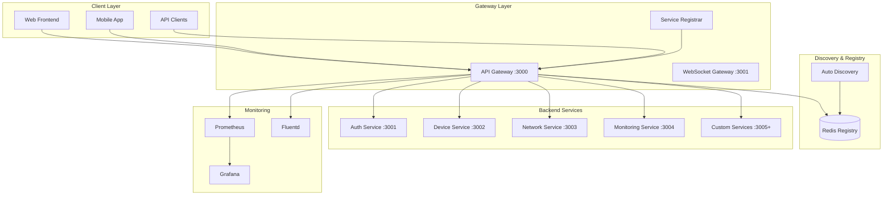
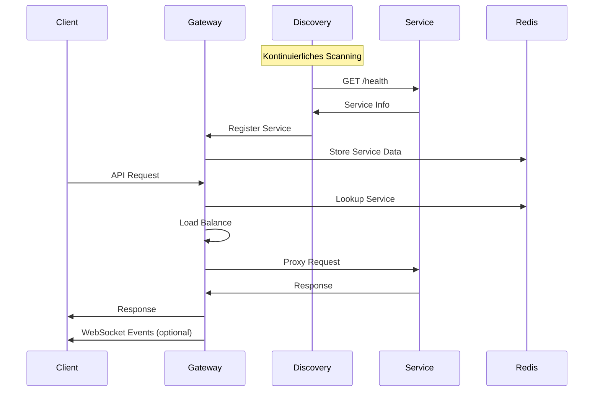
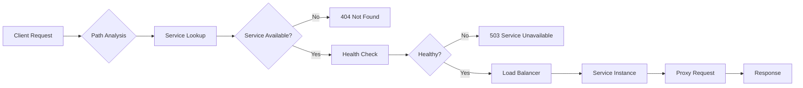

# OpenDirectory Auto-Extending API Gateway - Vollständige Dokumentation

## 📖 Inhaltsverzeichnis

1. [Überblick](#überblick)
2. [Architektur](#architektur)
3. [Installation & Setup](#installation--setup)
4. [Service Discovery](#service-discovery)
5. [Routing & Load Balancing](#routing--load-balancing)
6. [Security & Authentication](#security--authentication)
7. [Monitoring & Observability](#monitoring--observability)
8. [WebSocket Gateway](#websocket-gateway)
9. [API Referenz](#api-referenz)
10. [Service Integration](#service-integration)
11. [Deployment](#deployment)
12. [Troubleshooting](#troubleshooting)
13. [Best Practices](#best-practices)
14. [Erweiterte Konfiguration](#erweiterte-konfiguration)

---

## 🌟 Überblick

Das OpenDirectory Auto-Extending API Gateway ist eine zentrale, intelligente Routing-Schicht, die automatisch neue Services erkennt und sich dynamisch erweitert. Es fungiert als Single Entry Point für alle Microservices und bietet Enterprise-Level Features wie Load Balancing, Health Monitoring, Security und Real-time Communication.

### Hauptmerkmale

- ✅ **Vollautomatische Service Discovery** - Neue Services werden automatisch erkannt und registriert
- ✅ **Intelligente Pfad-Zuordnung** - Automatische URL-Route-Generierung basierend auf Service-Namen
- ✅ **Enterprise Load Balancing** - Multiple Strategien mit Health-basiertem Routing
- ✅ **Circuit Breaker Pattern** - Resilience und Fail-over Mechanismen
- ✅ **Real-time WebSocket Gateway** - Bidirektionale Kommunikation und Event-Broadcasting
- ✅ **Comprehensive Security** - JWT Authentication, Rate Limiting, CORS
- ✅ **Advanced Monitoring** - Structured Logging, Metrics, Health Aggregation
- ✅ **Zero-Configuration** - Services benötigen nur einen `/health` Endpoint

---

## 🏗️ Architektur

### Systemarchitektur



### Datenfluss



---

## 🚀 Installation & Setup

### Voraussetzungen

- **Node.js** >= 16.0.0
- **Redis** >= 6.0 (für Service Registry)
- **Docker** (optional, für Container-Deployment)
- **npm** oder **yarn**

### Schnellstart

```bash
# 1. Gateway klonen/herunterladen
cd services/api-gateway

# 2. Dependencies installieren
npm install

# 3. Environment konfigurieren
cp .env.example .env

# 4. Redis starten (wenn nicht vorhanden)
docker run -d --name redis -p 6379:6379 redis:7-alpine

# 5. Gateway starten
npm start

# 6. Verifizieren
curl http://localhost:3000/health
```

### Environment Konfiguration

Erstelle eine `.env` Datei:

```bash
# Gateway Configuration
NODE_ENV=development
API_GATEWAY_PORT=3000
LOG_LEVEL=info

# Redis Configuration
REDIS_HOST=localhost
REDIS_PORT=6379
REDIS_PASSWORD=

# Security Configuration
JWT_SECRET=your-super-secret-jwt-key-here
CORS_ORIGINS=http://localhost:3000,http://localhost:8080

# Service Discovery
DISCOVERY_ENABLED=true
DISCOVERY_INTERVAL=30000
DISCOVERY_TIMEOUT=5000
DISCOVERY_RETRIES=3
DISCOVERY_PORTS=3001,3002,3003,3004,3005,3006,3007,3008,3009,3010

# Health Monitoring
HEALTH_CHECK_INTERVAL=15000
HEALTH_CHECK_TIMEOUT=3000
HEALTH_CHECK_UNHEALTHY_THRESHOLD=3

# Rate Limiting
RATE_LIMIT_WINDOW_MS=900000
RATE_LIMIT_MAX=1000
RATE_LIMIT_SKIP_SUCCESS=false

# Load Balancing
LOAD_BALANCE_STRATEGY=round-robin
LOAD_BALANCE_STICKY_SESSION=false

# WebSocket
WEBSOCKET_PORT=3001
WEBSOCKET_VERIFY_CLIENT=false

# Monitoring
ENABLE_PROMETHEUS=true
PROMETHEUS_PORT=9090
ENABLE_STRUCTURED_LOGS=true
LOG_ROTATION_ENABLED=true
```

### Docker Setup

```bash
# Komplettes Setup mit allen Services
docker-compose up -d

# Nur Gateway und Redis
docker-compose up -d api-gateway redis

# Logs verfolgen
docker-compose logs -f api-gateway

# Services skalieren
docker-compose up -d --scale api-gateway=3
```

---

## 🔍 Service Discovery

### Automatische Discovery

Das Gateway scannt kontinuierlich konfigurierte Ports und erkennt Services automatisch basierend auf ihrem `/health` Endpoint.

#### Discovery-Prozess

1. **Port Scanning**: Gateway scannt konfigurierte Ports alle 30 Sekunden
2. **Health Check**: `GET /health` Request an jeden Port
3. **Service Parsing**: Extraktion von Service-Informationen
4. **Validation**: Überprüfung der Service-Daten
5. **Registration**: Automatische Registrierung im Gateway
6. **Route Creation**: Erstellung der API-Routen
7. **Broadcasting**: WebSocket-Benachrichtigung über neue Services

#### Health Endpoint Format

Services müssen einen `/health` Endpoint bereitstellen:

```javascript
app.get('/health', (req, res) => {
  res.json({
    // Pflichtfelder
    status: 'healthy',           // healthy | unhealthy | degraded
    service: 'payment-service',  // Eindeutiger Service-Name
    
    // Optionale Standard-Felder
    version: '1.2.3',           // Semantic Versioning
    uptime: process.uptime(),   // Uptime in Sekunden
    environment: 'production',  // development | staging | production
    
    // Service-spezifische Metadaten
    capabilities: [             // Feature-Liste
      'stripe-payments',
      'paypal-integration',
      'invoice-generation'
    ],
    
    // Technische Details
    pid: process.pid,
    memory: process.memoryUsage(),
    
    // Service-Status
    components: {               // Sub-Service Status
      database: 'healthy',
      redis: 'healthy',
      external_api: 'degraded'
    },
    
    // WebSocket Support (optional)
    websocket: {
      enabled: true,
      port: 3011
    },
    
    // Custom Metadata
    metadata: {
      region: 'eu-west-1',
      datacenter: 'dc-1',
      instance_id: 'payment-001'
    }
  });
});
```

#### Service-Name zu Pfad Mapping

Das Gateway generiert automatisch API-Pfade basierend auf Service-Namen:

| Service Name | Generated Path | Description |
|--------------|----------------|-------------|
| `authentication-service` | `/api/auth/*` | Benutzer-Authentifizierung |
| `device-service` | `/api/devices/*` | Geräte-Management |
| `network-infrastructure` | `/api/network/*` | Netzwerk-Services |
| `monitoring-service` | `/api/monitoring/*` | System-Monitoring |
| `user-service` | `/api/users/*` | Benutzer-Verwaltung |
| `notification-service` | `/api/notifications/*` | Push-Benachrichtigungen |
| `file-service` | `/api/files/*` | Datei-Management |
| `payment-service` | `/api/payment/*` | Payment-Processing |
| `analytics-service` | `/api/analytics/*` | Daten-Analyse |
| `custom-microservice` | `/api/custom-microservice/*` | Custom Service |

#### Manuelle Service-Registrierung

Für externe Services oder spezielle Konfigurationen:

```bash
curl -X POST http://localhost:3000/gateway/register \
  -H "Content-Type: application/json" \
  -d '{
    "id": "external-api",
    "name": "External Payment API",
    "host": "api.payment-provider.com",
    "port": 443,
    "path": "/api/payment",
    "version": "2.1.0",
    "ssl": true,
    "metadata": {
      "external": true,
      "provider": "stripe",
      "capabilities": ["webhooks", "subscriptions"]
    }
  }'
```

### Discovery Configuration

```javascript
// services/api-gateway/src/config/discovery.js
module.exports = {
  enabled: true,
  interval: 30000,        // Scan-Intervall in ms
  timeout: 5000,          // HTTP-Timeout für Health-Checks
  retries: 3,             // Retry-Anzahl bei Fehlern
  
  // Port-Bereiche für Discovery
  ports: {
    standard: [3001, 3002, 3003, 3004, 3005],
    extended: [3006, 3007, 3008, 3009, 3010],
    custom: []            // Zusätzliche Ports
  },
  
  // Health-Check Konfiguration
  healthPath: '/health',
  healthMethods: ['GET'],
  healthHeaders: {
    'User-Agent': 'OpenDirectory-Gateway-Discovery/2.0'
  },
  
  // Service-Validierung
  validation: {
    requiredFields: ['status', 'service'],
    allowedStatuses: ['healthy', 'unhealthy', 'degraded'],
    serviceNamePattern: /^[a-zA-Z0-9][a-zA-Z0-9\-_]*$/
  },
  
  // Pfad-Generierung
  pathGeneration: {
    prefix: '/api',
    mapping: {
      'auth-service': '/api/auth',
      'user-management': '/api/users'
      // Custom mappings
    }
  }
};
```

---

## 🌐 Routing & Load Balancing

### Intelligent Routing

Das Gateway verwendet intelligentes Routing basierend auf Service-Namen, Health-Status und Load Balancing-Strategien.

#### Request-Flow



#### URL-Pattern Matching

```javascript
// Automatische Pfad-Erkennung
const examples = {
  '/api/auth/login': {
    service: 'authentication-service',
    targetPath: '/login',
    method: 'POST'
  },
  '/api/devices/list': {
    service: 'device-service',
    targetPath: '/list',
    method: 'GET'
  },
  '/api/payment/process': {
    service: 'payment-service',
    targetPath: '/process',
    method: 'POST'
  }
};
```

### Load Balancing Strategien

#### 1. Round Robin (Default)

```javascript
class RoundRobinBalancer {
  constructor() {
    this.currentIndex = 0;
  }
  
  selectInstance(instances) {
    if (instances.length === 0) return null;
    
    const instance = instances[this.currentIndex % instances.length];
    this.currentIndex++;
    return instance;
  }
}

// Beispiel: 3 Service-Instanzen
// Request 1 → Instance A
// Request 2 → Instance B  
// Request 3 → Instance C
// Request 4 → Instance A (Zyklus wiederholt)
```

#### 2. Least Connections

```javascript
class LeastConnectionsBalancer {
  constructor() {
    this.connections = new Map();
  }
  
  selectInstance(instances) {
    return instances.reduce((least, current) => {
      const leastConns = this.connections.get(least.id) || 0;
      const currentConns = this.connections.get(current.id) || 0;
      return currentConns < leastConns ? current : least;
    });
  }
  
  onRequestStart(instanceId) {
    const current = this.connections.get(instanceId) || 0;
    this.connections.set(instanceId, current + 1);
  }
  
  onRequestEnd(instanceId) {
    const current = this.connections.get(instanceId) || 0;
    this.connections.set(instanceId, Math.max(0, current - 1));
  }
}
```

#### 3. Weighted Load Balancing

```javascript
class WeightedBalancer {
  selectInstance(instances) {
    const totalWeight = instances.reduce((sum, instance) => {
      return sum + (instance.weight || 1);
    }, 0);
    
    let random = Math.random() * totalWeight;
    
    for (const instance of instances) {
      random -= (instance.weight || 1);
      if (random <= 0) {
        return instance;
      }
    }
    
    return instances[0]; // Fallback
  }
}

// Service-Registrierung mit Gewichtung
{
  "id": "payment-service-1",
  "weight": 3,  // Bekommt 3x mehr Traffic
  "host": "powerful-server.local",
  "port": 3001
}
```

#### 4. Health-based Routing

```javascript
class HealthAwareBalancer {
  selectInstance(instances, healthStatus) {
    // Nur gesunde Instanzen berücksichtigen
    const healthyInstances = instances.filter(instance => {
      const health = healthStatus.get(instance.id);
      return health?.status === 'healthy';
    });
    
    if (healthyInstances.length === 0) {
      // Fallback zu degraded services wenn verfügbar
      return instances.find(instance => {
        const health = healthStatus.get(instance.id);
        return health?.status === 'degraded';
      });
    }
    
    // Verwende andere Strategie für gesunde Instanzen
    return this.roundRobin.selectInstance(healthyInstances);
  }
}
```

### Sticky Sessions

Für Services die Session-State halten:

```javascript
// Konfiguration
const stickySessionConfig = {
  enabled: true,
  cookieName: 'GATEWAY_SESSION',
  header: 'X-Session-ID',
  ttl: 1800000 // 30 Minuten
};

// Implementation
class StickySessionBalancer {
  constructor() {
    this.sessionMap = new Map();
  }
  
  selectInstance(instances, request) {
    const sessionId = this.extractSessionId(request);
    
    if (sessionId && this.sessionMap.has(sessionId)) {
      const instanceId = this.sessionMap.get(sessionId);
      const instance = instances.find(i => i.id === instanceId);
      
      if (instance && this.isHealthy(instance)) {
        return instance;
      }
    }
    
    // Neue Session oder Fallback
    const instance = this.fallbackBalancer.selectInstance(instances);
    if (sessionId && instance) {
      this.sessionMap.set(sessionId, instance.id);
    }
    
    return instance;
  }
}
```

### Circuit Breaker Pattern

```javascript
const CircuitBreaker = require('opossum');

class ServiceCircuitBreaker {
  constructor(serviceId, options = {}) {
    this.options = {
      timeout: 3000,                    // Request timeout
      errorThresholdPercentage: 50,     // Fehlerrate für OPEN
      resetTimeout: 30000,              // Zeit bis zu HALF_OPEN
      rollingCountTimeout: 10000,       // Rolling window
      rollingCountBuckets: 10,          // Bucket-Anzahl
      ...options
    };
    
    this.breaker = new CircuitBreaker(this.makeRequest.bind(this), this.options);
    this.setupEventHandlers();
  }
  
  async makeRequest(instance, request) {
    // Proxy request zur Service-Instanz
    return await this.proxyToInstance(instance, request);
  }
  
  setupEventHandlers() {
    this.breaker.on('open', () => {
      console.log(`🔴 Circuit breaker OPEN for ${this.serviceId}`);
      this.notifyServiceUnavailable();
    });
    
    this.breaker.on('halfOpen', () => {
      console.log(`🟡 Circuit breaker HALF-OPEN for ${this.serviceId}`);
    });
    
    this.breaker.on('close', () => {
      console.log(`🟢 Circuit breaker CLOSED for ${this.serviceId}`);
      this.notifyServiceAvailable();
    });
  }
  
  async execute(instance, request) {
    try {
      return await this.breaker.fire(instance, request);
    } catch (error) {
      if (this.breaker.opened) {
        throw new ServiceUnavailableError(`Service ${this.serviceId} is currently unavailable`);
      }
      throw error;
    }
  }
}
```

---

## 🔐 Security & Authentication

### JWT Authentication

Das Gateway unterstützt JWT-basierte Authentifizierung und leitet User-Kontext an Services weiter.

#### Token-Verarbeitung

```javascript
class AuthenticationMiddleware {
  async authenticateRequest(req, res, next) {
    const token = this.extractToken(req);
    
    if (!token) {
      // Unauthenticated requests passieren durch
      // Services können eigene Auth implementieren
      req.user = null;
      return next();
    }
    
    try {
      const decoded = jwt.verify(token, process.env.JWT_SECRET);
      req.user = decoded;
      
      // User-Kontext zu Service-Headers hinzufügen
      req.serviceHeaders = {
        'X-User-ID': decoded.sub || decoded.id,
        'X-User-Email': decoded.email,
        'X-User-Roles': JSON.stringify(decoded.roles || []),
        'X-User-Permissions': JSON.stringify(decoded.permissions || []),
        'X-Auth-Provider': decoded.provider || 'jwt'
      };
      
      next();
    } catch (error) {
      // Invalid token - let service handle
      req.user = null;
      req.authError = error.message;
      next();
    }
  }
  
  extractToken(req) {
    // Bearer Token
    if (req.headers.authorization?.startsWith('Bearer ')) {
      return req.headers.authorization.substring(7);
    }
    
    // Cookie Token
    if (req.cookies?.access_token) {
      return req.cookies.access_token;
    }
    
    // Query Parameter (nicht empfohlen für Produktion)
    if (req.query.token) {
      return req.query.token;
    }
    
    return null;
  }
}
```

#### Service-Header Weiterleitung

```javascript
// Gateway leitet Benutzer-Kontext an Services weiter
const proxyHeaders = {
  // Request Tracking
  'X-Request-ID': req.id,
  'X-Gateway-Version': '2.0.0',
  'X-Forwarded-For': req.ip,
  'X-Forwarded-Proto': req.protocol,
  
  // Authentication Context
  'X-User-ID': req.user?.id,
  'X-User-Email': req.user?.email,
  'X-User-Roles': JSON.stringify(req.user?.roles || []),
  'X-User-Permissions': JSON.stringify(req.user?.permissions || []),
  
  // Service Context
  'X-Service-ID': targetService.id,
  'X-Source-Service': 'api-gateway',
  
  // Security Context
  'X-Client-IP': req.ip,
  'X-User-Agent': req.headers['user-agent'],
  'X-Request-Time': new Date().toISOString()
};
```

### Rate Limiting

#### Globales Rate Limiting

```javascript
const rateLimit = require('express-rate-limit');

// Globale Rate Limits
const globalLimiter = rateLimit({
  windowMs: 15 * 60 * 1000, // 15 Minuten
  max: 1000,                // 1000 Requests pro IP
  message: {
    error: 'Too many requests from this IP',
    retryAfter: 900
  },
  standardHeaders: true,
  legacyHeaders: false
});

// Service-spezifische Limits
const serviceLimiters = {
  'auth': rateLimit({
    windowMs: 15 * 60 * 1000,
    max: 50,  // Strenger für Auth-Service
    message: 'Too many authentication attempts'
  }),
  
  'payment': rateLimit({
    windowMs: 60 * 1000,
    max: 10,  // Sehr streng für Payments
    message: 'Payment rate limit exceeded'
  })
};
```

#### Adaptive Rate Limiting

```javascript
class AdaptiveRateLimiter {
  constructor() {
    this.userLimits = new Map();
    this.serviceLimits = new Map();
  }
  
  async checkLimit(req, serviceId) {
    const userId = req.user?.id;
    const ip = req.ip;
    
    // Verschiedene Limits für verschiedene Benutzertypen
    const limits = this.calculateLimits(req.user, serviceId);
    
    // IP-basiertes Limiting
    const ipKey = `ip:${ip}:${serviceId}`;
    if (await this.isRateLimited(ipKey, limits.ip)) {
      throw new RateLimitError('IP rate limit exceeded');
    }
    
    // User-basiertes Limiting (wenn authentifiziert)
    if (userId) {
      const userKey = `user:${userId}:${serviceId}`;
      if (await this.isRateLimited(userKey, limits.user)) {
        throw new RateLimitError('User rate limit exceeded');
      }
    }
    
    return true;
  }
  
  calculateLimits(user, serviceId) {
    const defaultLimits = { ip: 100, user: 1000 };
    
    if (!user) return defaultLimits;
    
    // Premium users bekommen höhere Limits
    if (user.roles?.includes('premium')) {
      return { ip: 500, user: 5000 };
    }
    
    // Service-spezifische Anpassungen
    if (serviceId === 'payment' && user.verified) {
      return { ip: 50, user: 200 };
    }
    
    return defaultLimits;
  }
}
```

### CORS Configuration

```javascript
const corsOptions = {
  origin: function (origin, callback) {
    // Dynamische Origin-Validierung
    const allowedOrigins = [
      'http://localhost:3000',
      'https://app.opendirectory.com',
      process.env.FRONTEND_URL
    ];
    
    // Registrierte Services können auch Origins hinzufügen
    const serviceOrigins = this.getServiceOrigins();
    const allAllowed = [...allowedOrigins, ...serviceOrigins];
    
    if (!origin || allAllowed.includes(origin)) {
      callback(null, true);
    } else {
      callback(new Error('Not allowed by CORS policy'));
    }
  },
  
  credentials: true,
  methods: ['GET', 'POST', 'PUT', 'DELETE', 'PATCH', 'OPTIONS'],
  allowedHeaders: [
    'Content-Type',
    'Authorization', 
    'X-Request-ID',
    'X-Service-ID',
    'X-Client-Version'
  ],
  
  optionsSuccessStatus: 200
};
```

### Security Headers

```javascript
const helmet = require('helmet');

app.use(helmet({
  // Content Security Policy
  contentSecurityPolicy: {
    directives: {
      defaultSrc: ["'self'"],
      scriptSrc: ["'self'", "'unsafe-inline'", "'unsafe-eval'"],
      styleSrc: ["'self'", "'unsafe-inline'"],
      imgSrc: ["'self'", "data:", "https:", "http:"],
      connectSrc: ["'self'", "ws:", "wss:", "https:", "http:"],
      fontSrc: ["'self'", "https:", "data:"],
      objectSrc: ["'none'"],
      mediaSrc: ["'self'"],
      frameSrc: ["'none'"]
    }
  },
  
  // HTTP Strict Transport Security
  hsts: {
    maxAge: 31536000,
    includeSubDomains: true,
    preload: true
  },
  
  // Weitere Security Headers
  noSniff: true,
  frameguard: { action: 'deny' },
  xssFilter: true,
  referrerPolicy: { policy: 'strict-origin-when-cross-origin' }
}));
```

---

## 📊 Monitoring & Observability

### Structured Logging

Das Gateway verwendet Winston für strukturiertes Logging mit verschiedenen Log-Levels und Ausgabeformaten.

#### Log-Konfiguration

```javascript
const winston = require('winston');
const DailyRotateFile = require('winston-daily-rotate-file');

const logger = winston.createLogger({
  level: process.env.LOG_LEVEL || 'info',
  format: winston.format.combine(
    winston.format.timestamp(),
    winston.format.errors({ stack: true }),
    winston.format.json()
  ),
  
  defaultMeta: {
    service: 'api-gateway',
    version: '2.0.0',
    environment: process.env.NODE_ENV,
    hostname: os.hostname(),
    pid: process.pid
  },
  
  transports: [
    // Console für Development
    new winston.transports.Console({
      format: winston.format.combine(
        winston.format.colorize(),
        winston.format.simple()
      ),
      level: 'debug'
    }),
    
    // Rotating File für Production
    new DailyRotateFile({
      filename: 'logs/api-gateway-%DATE%.log',
      datePattern: 'YYYY-MM-DD',
      maxSize: '20m',
      maxFiles: '14d'
    }),
    
    // Error-spezifische Logs
    new DailyRotateFile({
      filename: 'logs/error-%DATE%.log',
      datePattern: 'YYYY-MM-DD',
      level: 'error',
      maxSize: '20m',
      maxFiles: '30d'
    }),
    
    // Access Logs
    new DailyRotateFile({
      filename: 'logs/access-%DATE%.log',
      datePattern: 'YYYY-MM-DD',
      format: winston.format.combine(
        winston.format.timestamp(),
        winston.format.printf(({ timestamp, level, message, ...meta }) => {
          return JSON.stringify({ timestamp, level, message, ...meta });
        })
      )
    })
  ]
});
```

#### Spezielle Log-Methoden

```javascript
// Request/Response Logging
logger.access = (message, meta = {}) => {
  logger.info(message, {
    type: 'access',
    ...meta
  });
};

// Security Events
logger.security = (message, meta = {}) => {
  logger.warn(`🔒 SECURITY: ${message}`, {
    type: 'security',
    severity: 'high',
    timestamp: new Date().toISOString(),
    ...meta
  });
};

// Performance Monitoring
logger.performance = (operation, duration, meta = {}) => {
  const level = duration > 5000 ? 'warn' : 'info';
  logger[level](`⚡ ${operation} took ${duration}ms`, {
    type: 'performance',
    operation,
    duration,
    slow: duration > 1000,
    ...meta
  });
};

// Service Discovery
logger.discovery = (message, meta = {}) => {
  logger.info(`🔍 ${message}`, {
    type: 'discovery',
    ...meta
  });
};

// Beispiel-Verwendung
logger.access('API Request processed', {
  method: 'POST',
  path: '/api/auth/login',
  statusCode: 200,
  duration: 150,
  ip: '192.168.1.100',
  userAgent: 'Mozilla/5.0...',
  userId: 'user123'
});

logger.security('Failed login attempt', {
  ip: '192.168.1.100',
  username: 'admin',
  reason: 'invalid_password',
  attempts: 3
});
```

### Metrics Collection

#### Request Metrics

```javascript
class MetricsCollector {
  constructor() {
    this.metrics = {
      requests: {
        total: 0,
        successful: 0,
        failed: 0,
        byService: new Map(),
        byStatusCode: new Map(),
        responseTimeHistogram: []
      },
      services: {
        registered: 0,
        healthy: 0,
        unhealthy: 0,
        responseTimeByService: new Map()
      },
      connections: {
        activeHttp: 0,
        activeWebSocket: 0,
        totalProcessed: 0
      }
    };
  }
  
  recordRequest(req, res, duration) {
    this.metrics.requests.total++;
    
    if (res.statusCode >= 200 && res.statusCode < 400) {
      this.metrics.requests.successful++;
    } else {
      this.metrics.requests.failed++;
    }
    
    // Service-spezifische Metriken
    const serviceId = req.serviceId;
    if (serviceId) {
      const serviceMetrics = this.metrics.requests.byService.get(serviceId) || {
        total: 0,
        successful: 0,
        failed: 0,
        avgResponseTime: 0
      };
      
      serviceMetrics.total++;
      if (res.statusCode < 400) {
        serviceMetrics.successful++;
      } else {
        serviceMetrics.failed++;
      }
      
      // Moving average für Response Time
      const count = serviceMetrics.total;
      serviceMetrics.avgResponseTime = 
        ((serviceMetrics.avgResponseTime * (count - 1)) + duration) / count;
      
      this.metrics.requests.byService.set(serviceId, serviceMetrics);
    }
    
    // Status Code Distribution
    const statusCode = res.statusCode;
    const currentCount = this.metrics.requests.byStatusCode.get(statusCode) || 0;
    this.metrics.requests.byStatusCode.set(statusCode, currentCount + 1);
    
    // Response Time Histogram
    this.updateResponseTimeHistogram(duration);
  }
  
  updateResponseTimeHistogram(duration) {
    const buckets = [50, 100, 200, 500, 1000, 2000, 5000];
    const histogram = this.metrics.requests.responseTimeHistogram;
    
    // Initialize buckets if needed
    if (histogram.length === 0) {
      buckets.forEach((bucket, index) => {
        histogram[index] = { bucket, count: 0 };
      });
      histogram.push({ bucket: Infinity, count: 0 });
    }
    
    // Update appropriate bucket
    for (let i = 0; i < histogram.length; i++) {
      if (duration <= histogram[i].bucket) {
        histogram[i].count++;
        break;
      }
    }
  }
  
  getMetrics() {
    return {
      ...this.metrics,
      timestamp: new Date().toISOString(),
      uptime: process.uptime(),
      memory: process.memoryUsage(),
      cpu: process.cpuUsage()
    };
  }
  
  resetMetrics() {
    // Reset counters but keep configuration
    this.metrics.requests.total = 0;
    this.metrics.requests.successful = 0;
    this.metrics.requests.failed = 0;
    this.metrics.requests.responseTimeHistogram = [];
    this.metrics.connections.totalProcessed = 0;
  }
}
```

#### Health Monitoring

```javascript
class HealthMonitor {
  constructor(services, redis) {
    this.services = services;
    this.redis = redis;
    this.healthStatus = new Map();
    this.healthHistory = new Map();
  }
  
  async performHealthCheck(service) {
    const startTime = Date.now();
    
    try {
      const response = await axios.get(
        `http://${service.host}:${service.port}/health`,
        { timeout: 3000 }
      );
      
      const duration = Date.now() - startTime;
      const healthData = {
        status: 'healthy',
        responseTime: duration,
        timestamp: new Date().toISOString(),
        data: response.data,
        consecutiveFailures: 0
      };
      
      this.updateHealthStatus(service.id, healthData);
      
      logger.debug(`Health check passed for ${service.id}`, {
        serviceId: service.id,
        responseTime: duration
      });
      
    } catch (error) {
      const duration = Date.now() - startTime;
      const currentHealth = this.healthStatus.get(service.id) || { consecutiveFailures: 0 };
      
      const healthData = {
        status: 'unhealthy',
        responseTime: duration,
        timestamp: new Date().toISOString(),
        error: error.message,
        consecutiveFailures: currentHealth.consecutiveFailures + 1
      };
      
      this.updateHealthStatus(service.id, healthData);
      
      logger.warn(`Health check failed for ${service.id}`, {
        serviceId: service.id,
        error: error.message,
        consecutiveFailures: healthData.consecutiveFailures
      });
    }
  }
  
  updateHealthStatus(serviceId, healthData) {
    this.healthStatus.set(serviceId, healthData);
    
    // Store in Redis for persistence
    this.redis.setex(
      `health:${serviceId}`,
      300, // 5 minutes TTL
      JSON.stringify(healthData)
    );
    
    // Update health history
    this.updateHealthHistory(serviceId, healthData);
  }
  
  updateHealthHistory(serviceId, healthData) {
    const history = this.healthHistory.get(serviceId) || [];
    
    history.push({
      status: healthData.status,
      timestamp: healthData.timestamp,
      responseTime: healthData.responseTime
    });
    
    // Keep only last 100 entries
    if (history.length > 100) {
      history.shift();
    }
    
    this.healthHistory.set(serviceId, history);
  }
  
  getAggregatedHealth() {
    const services = Array.from(this.healthStatus.entries()).map(([id, health]) => ({
      id,
      ...health
    }));
    
    const healthy = services.filter(s => s.status === 'healthy').length;
    const total = services.length;
    
    const overallStatus = total === 0 ? 'no-services' :
                         healthy === total ? 'healthy' :
                         healthy > 0 ? 'degraded' : 'unhealthy';
    
    return {
      overall: overallStatus,
      services,
      summary: {
        total,
        healthy,
        unhealthy: total - healthy,
        healthPercentage: total > 0 ? Math.round((healthy / total) * 100) : 0
      }
    };
  }
}
```

### Prometheus Integration

```javascript
// prometheus-metrics.js
const client = require('prom-client');

class PrometheusMetrics {
  constructor() {
    // Register für Default-Metriken
    client.register.clear();
    client.collectDefaultMetrics({ timeout: 5000 });
    
    // Custom Metriken
    this.httpRequestsTotal = new client.Counter({
      name: 'gateway_http_requests_total',
      help: 'Total number of HTTP requests',
      labelNames: ['method', 'service', 'status_code']
    });
    
    this.httpRequestDuration = new client.Histogram({
      name: 'gateway_http_request_duration_seconds',
      help: 'Duration of HTTP requests in seconds',
      labelNames: ['method', 'service', 'status_code'],
      buckets: [0.1, 0.3, 0.5, 0.7, 1, 3, 5, 7, 10]
    });
    
    this.activeConnections = new client.Gauge({
      name: 'gateway_active_connections',
      help: 'Number of active connections',
      labelNames: ['type']
    });
    
    this.serviceHealth = new client.Gauge({
      name: 'gateway_service_health',
      help: 'Health status of services (1=healthy, 0=unhealthy)',
      labelNames: ['service_id', 'service_name']
    });
    
    this.serviceDiscoveryTotal = new client.Counter({
      name: 'gateway_service_discovery_total',
      help: 'Total number of service discovery events',
      labelNames: ['event_type']
    });
  }
  
  recordHttpRequest(req, res, duration) {
    const labels = {
      method: req.method,
      service: req.serviceId || 'unknown',
      status_code: res.statusCode
    };
    
    this.httpRequestsTotal.inc(labels);
    this.httpRequestDuration.observe(labels, duration / 1000);
  }
  
  updateConnectionCount(httpCount, wsCount) {
    this.activeConnections.set({ type: 'http' }, httpCount);
    this.activeConnections.set({ type: 'websocket' }, wsCount);
  }
  
  updateServiceHealth(serviceId, serviceName, isHealthy) {
    this.serviceHealth.set(
      { service_id: serviceId, service_name: serviceName },
      isHealthy ? 1 : 0
    );
  }
  
  recordServiceDiscovery(eventType) {
    this.serviceDiscoveryTotal.inc({ event_type: eventType });
  }
  
  getMetrics() {
    return client.register.metrics();
  }
}

// Metrics Endpoint
app.get('/metrics', async (req, res) => {
  try {
    res.set('Content-Type', client.register.contentType);
    const metrics = await prometheusMetrics.getMetrics();
    res.end(metrics);
  } catch (error) {
    res.status(500).json({ error: 'Failed to collect metrics' });
  }
});
```

### Monitoring Dashboard

Das Gateway stellt eine integrierte Monitoring-Dashboard zur Verfügung:

```javascript
// /admin/dashboard Endpoint
app.get('/admin/dashboard', (req, res) => {
  const dashboardHtml = `
<!DOCTYPE html>
<html>
<head>
    <title>OpenDirectory API Gateway Dashboard</title>
    <meta charset="utf-8">
    <meta name="viewport" content="width=device-width, initial-scale=1">
    <style>
        body { font-family: -apple-system, sans-serif; margin: 0; background: #f5f5f5; }
        .container { max-width: 1200px; margin: 0 auto; padding: 20px; }
        .header { background: white; padding: 20px; border-radius: 8px; margin-bottom: 20px; }
        .grid { display: grid; grid-template-columns: repeat(auto-fit, minmax(300px, 1fr)); gap: 20px; }
        .card { background: white; padding: 20px; border-radius: 8px; box-shadow: 0 2px 4px rgba(0,0,0,0.1); }
        .metric { font-size: 2rem; font-weight: bold; color: #2563eb; }
        .status-healthy { color: #16a34a; }
        .status-unhealthy { color: #dc2626; }
        .status-degraded { color: #ca8a04; }
        .service-list { list-style: none; padding: 0; }
        .service-item { padding: 8px 0; border-bottom: 1px solid #e5e7eb; }
        .refresh-btn { background: #2563eb; color: white; border: none; padding: 10px 20px; border-radius: 4px; cursor: pointer; }
    </style>
</head>
<body>
    <div class="container">
        <div class="header">
            <h1>🚀 OpenDirectory API Gateway Dashboard</h1>
            <button class="refresh-btn" onclick="location.reload()">🔄 Refresh</button>
        </div>
        
        <div class="grid">
            <div class="card">
                <h3>📊 Request Metrics</h3>
                <div class="metric" id="total-requests">Loading...</div>
                <p>Total Requests</p>
                <div>Success Rate: <span id="success-rate">-</span>%</div>
                <div>Avg Response Time: <span id="avg-response">-</span>ms</div>
            </div>
            
            <div class="card">
                <h3>🏥 Service Health</h3>
                <div class="metric" id="healthy-services">Loading...</div>
                <p>Healthy Services</p>
                <div>Total Services: <span id="total-services">-</span></div>
                <div>Health Percentage: <span id="health-percentage">-</span>%</div>
            </div>
            
            <div class="card">
                <h3>🔗 Active Connections</h3>
                <div class="metric" id="active-connections">Loading...</div>
                <p>HTTP Connections</p>
                <div>WebSocket: <span id="ws-connections">-</span></div>
                <div>Total Processed: <span id="total-processed">-</span></div>
            </div>
            
            <div class="card">
                <h3>🔍 Registered Services</h3>
                <ul class="service-list" id="services-list">
                    <li>Loading...</li>
                </ul>
            </div>
        </div>
    </div>
    
    <script>
        async function loadDashboardData() {
            try {
                const [metrics, services, health] = await Promise.all([
                    fetch('/metrics').then(r => r.json()),
                    fetch('/services').then(r => r.json()),
                    fetch('/health').then(r => r.json())
                ]);
                
                // Update metrics
                document.getElementById('total-requests').textContent = metrics.total;
                document.getElementById('success-rate').textContent = 
                    Math.round((metrics.successful / metrics.total) * 100);
                document.getElementById('avg-response').textContent = 
                    Math.round(metrics.averageResponseTime);
                
                // Update health
                document.getElementById('healthy-services').textContent = health.services.healthy;
                document.getElementById('total-services').textContent = health.services.total;
                document.getElementById('health-percentage').textContent = 
                    Math.round((health.services.healthy / health.services.total) * 100);
                
                // Update connections
                document.getElementById('active-connections').textContent = metrics.connections.active;
                document.getElementById('ws-connections').textContent = metrics.connections.websocket;
                
                // Update services list
                const servicesList = document.getElementById('services-list');
                servicesList.innerHTML = services.services.map(service => 
                    \`<li class="service-item">
                        <strong>\${service.name}</strong> v\${service.version}
                        <span class="status-\${service.status}">●</span>
                        <br><small>\${service.host}:\${service.port}</small>
                    </li>\`
                ).join('');
                
            } catch (error) {
                console.error('Failed to load dashboard data:', error);
            }
        }
        
        // Load initial data
        loadDashboardData();
        
        // Auto-refresh every 30 seconds
        setInterval(loadDashboardData, 30000);
    </script>
</body>
</html>
  `;
  
  res.send(dashboardHtml);
});
```

---

## 🌐 WebSocket Gateway

### WebSocket-Server Setup

```javascript
const WebSocket = require('ws');

class WebSocketGateway {
  constructor(gatewayInstance) {
    this.gateway = gatewayInstance;
    this.wss = new WebSocket.Server({
      port: parseInt(process.env.WEBSOCKET_PORT) || 3001,
      verifyClient: this.verifyClient.bind(this)
    });
    
    this.clients = new Map();
    this.subscriptions = new Map();
    this.messageHandlers = new Map();
    
    this.setupServer();
    this.registerMessageHandlers();
  }
  
  setupServer() {
    this.wss.on('connection', (ws, req) => {
      const clientId = this.generateClientId();
      
      const client = {
        id: clientId,
        ws: ws,
        ip: req.socket.remoteAddress,
        userAgent: req.headers['user-agent'],
        authenticated: false,
        user: null,
        subscriptions: new Set(),
        connectedAt: new Date(),
        lastActivity: new Date(),
        messageCount: 0
      };
      
      this.clients.set(clientId, client);
      
      logger.info('🔌 WebSocket client connected', {
        clientId,
        ip: client.ip,
        totalClients: this.clients.size
      });
      
      this.setupClientHandlers(client);
      this.sendWelcomeMessage(client);
    });
    
    // Periodic cleanup and health checks
    setInterval(() => {
      this.performHealthCheck();
    }, 30000);
    
    logger.info(`🌐 WebSocket Gateway listening on port ${this.wss.options.port}`);
  }
  
  setupClientHandlers(client) {
    const { ws } = client;
    
    ws.on('message', async (message) => {
      try {
        client.lastActivity = new Date();
        client.messageCount++;
        
        const data = JSON.parse(message.toString());
        await this.handleMessage(client, data);
        
      } catch (error) {
        logger.error('❌ WebSocket message error:', error, { clientId: client.id });
        this.sendError(client, 'Invalid message format', data?.requestId);
      }
    });
    
    ws.on('pong', () => {
      client.isAlive = true;
      client.lastActivity = new Date();
    });
    
    ws.on('close', (code, reason) => {
      this.handleClientDisconnect(client, code, reason);
    });
    
    ws.on('error', (error) => {
      logger.error('❌ WebSocket client error:', error, { clientId: client.id });
    });
  }
  
  async handleMessage(client, message) {
    const { type, data, requestId } = message;
    
    // Rate limiting pro Client
    if (!this.checkRateLimit(client)) {
      return this.sendError(client, 'Rate limit exceeded', requestId);
    }
    
    // Message handler aufrufen
    const handler = this.messageHandlers.get(type);
    if (!handler) {
      return this.sendError(client, `Unknown message type: ${type}`, requestId);
    }
    
    try {
      await handler(client, data, requestId);
    } catch (error) {
      logger.error(`❌ WebSocket handler error for ${type}:`, error);
      this.sendError(client, `Handler error: ${error.message}`, requestId);
    }
  }
  
  registerMessageHandlers() {
    // Authentication
    this.messageHandlers.set('authenticate', this.handleAuthenticate.bind(this));
    
    // Subscriptions
    this.messageHandlers.set('subscribe', this.handleSubscribe.bind(this));
    this.messageHandlers.set('unsubscribe', this.handleUnsubscribe.bind(this));
    
    // Service interactions
    this.messageHandlers.set('getServices', this.handleGetServices.bind(this));
    this.messageHandlers.set('getServiceHealth', this.handleGetServiceHealth.bind(this));
    
    // Gateway status
    this.messageHandlers.set('getGatewayStatus', this.handleGetGatewayStatus.bind(this));
    this.messageHandlers.set('getMetrics', this.handleGetMetrics.bind(this));
    
    // Ping/Pong
    this.messageHandlers.set('ping', this.handlePing.bind(this));
  }
  
  async handleAuthenticate(client, data, requestId) {
    const { token, clientType } = data;
    
    if (!token) {
      return this.sendError(client, 'Token required', requestId);
    }
    
    try {
      const decoded = jwt.verify(token, process.env.JWT_SECRET);
      
      client.authenticated = true;
      client.user = decoded;
      client.clientType = clientType;
      
      this.sendResponse(client, 'authenticated', {
        success: true,
        user: {
          id: decoded.id || decoded.sub,
          email: decoded.email,
          roles: decoded.roles || []
        }
      }, requestId);
      
      logger.info('✅ WebSocket client authenticated', {
        clientId: client.id,
        userId: decoded.id || decoded.sub
      });
      
    } catch (error) {
      client.authenticated = false;
      this.sendResponse(client, 'authenticated', {
        success: false,
        error: 'Invalid token'
      }, requestId);
    }
  }
  
  async handleSubscribe(client, data, requestId) {
    const { topics } = data;
    
    if (!Array.isArray(topics)) {
      return this.sendError(client, 'Topics must be an array', requestId);
    }
    
    for (const topic of topics) {
      if (this.isValidTopic(topic)) {
        client.subscriptions.add(topic);
        
        // Add to global subscriptions map
        if (!this.subscriptions.has(topic)) {
          this.subscriptions.set(topic, new Set());
        }
        this.subscriptions.get(topic).add(client.id);
      }
    }
    
    this.sendResponse(client, 'subscribed', {
      topics: Array.from(client.subscriptions),
      totalSubscriptions: client.subscriptions.size
    }, requestId);
    
    logger.debug('📺 WebSocket subscriptions updated', {
      clientId: client.id,
      newTopics: topics,
      totalSubscriptions: client.subscriptions.size
    });
  }
  
  isValidTopic(topic) {
    const validPatterns = [
      /^gateway:.+/,      // gateway:status, gateway:config
      /^service:.+/,      // service:discovered, service:health
      /^discovery:.+/,    // discovery:scan, discovery:update
      /^health:.+/,       // health:check, health:alert
      /^metrics:.+/,      // metrics:update, metrics:alert
      /^error:.+/         // error:service, error:gateway
    ];
    
    return validPatterns.some(pattern => pattern.test(topic));
  }
  
  // Broadcasting Methods
  broadcast(topic, data) {
    const subscribers = this.subscriptions.get(topic);
    if (!subscribers) return;
    
    const message = JSON.stringify({
      type: 'event',
      topic,
      data,
      timestamp: new Date().toISOString()
    });
    
    subscribers.forEach(clientId => {
      const client = this.clients.get(clientId);
      if (client && client.ws.readyState === WebSocket.OPEN) {
        client.ws.send(message);
      }
    });
    
    logger.debug(`📡 Broadcasted to topic ${topic}`, {
      topic,
      subscribers: subscribers.size
    });
  }
  
  broadcastToAll(data) {
    const message = JSON.stringify({
      type: 'broadcast',
      data,
      timestamp: new Date().toISOString()
    });
    
    this.clients.forEach(client => {
      if (client.ws.readyState === WebSocket.OPEN) {
        client.ws.send(message);
      }
    });
  }
  
  sendToUser(userId, data) {
    const userClients = Array.from(this.clients.values())
      .filter(client => client.user?.id === userId);
    
    const message = JSON.stringify({
      type: 'userMessage',
      data,
      timestamp: new Date().toISOString()
    });
    
    userClients.forEach(client => {
      if (client.ws.readyState === WebSocket.OPEN) {
        client.ws.send(message);
      }
    });
  }
}
```

### Event Broadcasting

```javascript
// Service Discovery Events
gateway.on('serviceDiscovered', (service) => {
  wsGateway.broadcast('service:discovered', service);
});

gateway.on('serviceRemoved', (serviceId) => {
  wsGateway.broadcast('service:removed', { serviceId });
});

gateway.on('serviceHealthChanged', (serviceId, health) => {
  wsGateway.broadcast('service:health', { serviceId, health });
});

// Gateway Events
gateway.on('configUpdated', (config) => {
  wsGateway.broadcast('gateway:config', config);
});

gateway.on('metricsUpdated', (metrics) => {
  wsGateway.broadcast('metrics:update', metrics);
});

// Error Events
gateway.on('error', (error, context) => {
  wsGateway.broadcast('error:gateway', {
    error: error.message,
    context,
    severity: 'high'
  });
});
```

---

## 📖 API Referenz

### Gateway Management

#### GET /health
Gateway Health Status

**Response:**
```json
{
  "status": "healthy",
  "gateway": {
    "version": "2.0.0",
    "uptime": 3600,
    "memory": {
      "rss": 45678592,
      "heapTotal": 12345678,
      "heapUsed": 8765432,
      "external": 1234567
    },
    "activeConnections": 15,
    "websocketConnections": 3
  },
  "services": {
    "total": 5,
    "healthy": 4,
    "unhealthy": 1
  },
  "timestamp": "2024-01-15T10:30:00Z"
}
```

#### GET /status
Detaillierter Gateway-Status

**Response:**
```json
{
  "gateway": {
    "version": "2.0.0",
    "startTime": "2024-01-15T08:00:00Z",
    "uptime": 9000,
    "environment": "production",
    "pid": 1234,
    "nodeVersion": "v18.17.0"
  },
  "services": [
    {
      "id": "auth-service",
      "name": "authentication-service",
      "version": "1.0.0",
      "host": "localhost",
      "port": 3001,
      "path": "/api/auth",
      "health": {
        "status": "healthy",
        "responseTime": 45,
        "lastCheck": "2024-01-15T10:29:30Z"
      },
      "instances": [
        {
          "host": "localhost",
          "port": 3001,
          "weight": 1
        }
      ]
    }
  ],
  "metrics": {
    "total": 15689,
    "successful": 15234,
    "failed": 455,
    "averageResponseTime": 234
  },
  "timestamp": "2024-01-15T10:30:00Z"
}
```

#### GET /services
Registrierte Services auflisten

**Query Parameters:**
- `status` (optional): Filter nach Status (`healthy`, `unhealthy`, `all`)
- `version` (optional): Filter nach Version

**Response:**
```json
{
  "services": [
    {
      "id": "auth-service",
      "name": "authentication-service",
      "version": "1.0.0",
      "host": "localhost",
      "port": 3001,
      "path": "/api/auth",
      "status": "healthy",
      "lastSeen": "2024-01-15T10:29:30Z",
      "metadata": {
        "capabilities": ["oauth", "ldap", "mfa"],
        "environment": "production"
      }
    }
  ],
  "total": 5,
  "healthy": 4,
  "timestamp": "2024-01-15T10:30:00Z"
}
```

#### POST /gateway/register
Service manuell registrieren

**Request Body:**
```json
{
  "id": "payment-service",
  "name": "payment-service",
  "host": "localhost",
  "port": 3009,
  "path": "/api/payment",
  "version": "1.0.0",
  "ssl": false,
  "weight": 1,
  "metadata": {
    "capabilities": ["stripe", "paypal"],
    "environment": "production",
    "region": "eu-west-1"
  }
}
```

**Response:**
```json
{
  "success": true,
  "message": "Service registered successfully",
  "serviceId": "payment-service"
}
```

#### DELETE /gateway/register/:serviceId
Service deregistrieren

**Response:**
```json
{
  "success": true,
  "message": "Service unregistered successfully",
  "serviceId": "payment-service"
}
```

### Monitoring & Metrics

#### GET /metrics
Gateway-Metriken abrufen

**Response:**
```json
{
  "total": 15689,
  "successful": 15234,
  "failed": 455,
  "averageResponseTime": 234,
  "services": {
    "total": 5,
    "healthy": 4,
    "discovering": true
  },
  "connections": {
    "active": 15,
    "websocket": 3
  },
  "uptime": 9000,
  "memory": {
    "rss": 45678592,
    "heapTotal": 12345678,
    "heapUsed": 8765432,
    "external": 1234567
  },
  "timestamp": "2024-01-15T10:30:00Z"
}
```

#### GET /admin/services/:serviceId/health
Spezifischer Service-Health Status

**Response:**
```json
{
  "serviceId": "auth-service",
  "service": {
    "id": "auth-service",
    "name": "authentication-service",
    "host": "localhost",
    "port": 3001
  },
  "health": {
    "status": "healthy",
    "responseTime": 45,
    "lastCheck": "2024-01-15T10:29:30Z",
    "consecutiveFailures": 0,
    "data": {
      "uptime": 3600,
      "components": {
        "database": "healthy",
        "redis": "healthy"
      }
    }
  },
  "timestamp": "2024-01-15T10:30:00Z"
}
```

### Admin Endpoints

#### GET /admin/connections
Aktive Verbindungen anzeigen

**Response:**
```json
{
  "connections": [
    {
      "id": "req-123-456",
      "method": "POST",
      "url": "/api/auth/login",
      "startTime": "2024-01-15T10:29:45Z",
      "duration": 1500,
      "ip": "192.168.1.100"
    }
  ],
  "total": 15,
  "timestamp": "2024-01-15T10:30:00Z"
}
```

#### POST /admin/services/:serviceId/reload
Service neu laden (Health Check forcieren)

**Response:**
```json
{
  "success": true,
  "message": "Service reload triggered",
  "serviceId": "auth-service"
}
```

### Service Proxying

Alle Requests an `/api/{service}/*` werden automatisch an den entsprechenden Service weitergeleitet.

#### Beispiele:

```bash
# Auth Service
POST /api/auth/login
→ Proxied zu: localhost:3001/login

GET /api/auth/profile
→ Proxied zu: localhost:3001/profile

# Device Service  
GET /api/devices/list
→ Proxied zu: localhost:3002/list

POST /api/devices/enroll
→ Proxied zu: localhost:3002/enroll

# Custom Service
GET /api/payment/transactions
→ Proxied zu: localhost:3009/transactions
```

#### Request Headers

Das Gateway fügt automatisch Headers hinzu:

```bash
X-Request-ID: req-123-456-789
X-Gateway-Version: 2.0.0
X-Forwarded-For: 192.168.1.100
X-User-ID: user-123 (wenn authentifiziert)
X-User-Roles: ["admin", "user"] (wenn authentifiziert)
X-Service-ID: target-service-id
```

### Error Responses

#### Service nicht gefunden (404)
```json
{
  "error": "Service not found",
  "serviceId": "unknown-service",
  "availableServices": ["auth", "devices", "network"],
  "help": "Register your service using POST /gateway/register",
  "timestamp": "2024-01-15T10:30:00Z"
}
```

#### Service nicht verfügbar (503)
```json
{
  "error": "Service temporarily unavailable",
  "serviceId": "payment-service",
  "retryAfter": 30,
  "timestamp": "2024-01-15T10:30:00Z"
}
```

#### Rate Limit überschritten (429)
```json
{
  "error": "Too many requests from this IP",
  "retryAfter": 900,
  "limit": 1000,
  "window": "15 minutes",
  "timestamp": "2024-01-15T10:30:00Z"
}
```

---

## 🔧 Service Integration

### Service entwickeln

#### 1. Basis-Setup

```javascript
// services/my-service/src/index.js
const express = require('express');
const app = express();

// Middleware
app.use(express.json());

// ERFORDERLICH: Health Check Endpoint
app.get('/health', (req, res) => {
  res.json({
    status: 'healthy',
    service: 'my-service',
    version: '1.0.0',
    uptime: process.uptime(),
    capabilities: ['feature1', 'feature2'],
    environment: process.env.NODE_ENV || 'development'
  });
});

// Deine Service-Endpoints
app.get('/data', (req, res) => {
  res.json({ message: 'Hello from my-service' });
});

app.post('/process', (req, res) => {
  res.json({ result: 'Data processed successfully' });
});

const PORT = process.env.PORT || 3011;
app.listen(PORT, () => {
  console.log(`My Service running on port ${PORT}`);
  console.log(`Health check: http://localhost:${PORT}/health`);
});
```

#### 2. Package.json

```json
{
  "name": "@opendirectory/my-service",
  "version": "1.0.0",
  "description": "My custom OpenDirectory service",
  "main": "src/index.js",
  "scripts": {
    "start": "node src/index.js",
    "dev": "nodemon src/index.js",
    "health": "curl -f http://localhost:3011/health"
  },
  "dependencies": {
    "express": "^4.18.2"
  },
  "devDependencies": {
    "nodemon": "^3.0.1"
  }
}
```

#### 3. Service starten

```bash
cd services/my-service
npm install
npm start
```

Das Gateway erkennt den Service automatisch und erstellt die Route `/api/my-service/*`.

### Advanced Service Features

#### Gateway Headers nutzen

```javascript
// Service kann Gateway-Headers auslesen
app.use((req, res, next) => {
  // Request-Tracking
  const requestId = req.headers['x-request-id'];
  const gatewayVersion = req.headers['x-gateway-version'];
  
  // Benutzer-Kontext (wenn über Gateway authentifiziert)
  const userId = req.headers['x-user-id'];
  const userRoles = JSON.parse(req.headers['x-user-roles'] || '[]');
  const userPermissions = JSON.parse(req.headers['x-user-permissions'] || '[]');
  
  // Context an Request anhängen
  req.gateway = {
    requestId,
    version: gatewayVersion,
    user: userId ? {
      id: userId,
      email: req.headers['x-user-email'],
      roles: userRoles,
      permissions: userPermissions
    } : null
  };
  
  next();
});

// In Endpoints verwenden
app.get('/protected-data', (req, res) => {
  if (!req.gateway.user) {
    return res.status(401).json({ error: 'Authentication required' });
  }
  
  if (!req.gateway.user.roles.includes('admin')) {
    return res.status(403).json({ error: 'Admin access required' });
  }
  
  res.json({ 
    data: 'Secret admin data',
    requestedBy: req.gateway.user.id,
    requestId: req.gateway.requestId
  });
});
```

#### Health Check erweitern

```javascript
// Erweiterte Health-Informationen
app.get('/health', async (req, res) => {
  const healthData = {
    status: 'healthy',
    service: 'my-service',
    version: process.env.npm_package_version || '1.0.0',
    uptime: process.uptime(),
    environment: process.env.NODE_ENV || 'development',
    
    // Capabilities
    capabilities: [
      'data-processing',
      'file-upload',
      'notifications'
    ],
    
    // System Information
    pid: process.pid,
    memory: process.memoryUsage(),
    nodeVersion: process.version,
    
    // Service-spezifische Components
    components: {},
    
    // Custom Metadata
    metadata: {
      region: process.env.AWS_REGION || 'local',
      instance: process.env.INSTANCE_ID || 'dev-001'
    }
  };
  
  // Database Connection Check
  try {
    await checkDatabaseConnection();
    healthData.components.database = 'healthy';
  } catch (error) {
    healthData.components.database = 'unhealthy';
    healthData.status = 'degraded';
  }
  
  // Redis Connection Check
  try {
    await checkRedisConnection();
    healthData.components.redis = 'healthy';
  } catch (error) {
    healthData.components.redis = 'unhealthy';
    if (healthData.status !== 'degraded') {
      healthData.status = 'degraded';
    }
  }
  
  // External API Check
  try {
    await checkExternalAPI();
    healthData.components.externalAPI = 'healthy';
  } catch (error) {
    healthData.components.externalAPI = 'unhealthy';
    // External API failures don't change main status
  }
  
  res.json(healthData);
});

async function checkDatabaseConnection() {
  // Database ping implementation
  // throw error if connection fails
}

async function checkRedisConnection() {
  // Redis ping implementation
  // throw error if connection fails
}

async function checkExternalAPI() {
  // External API health check
  // throw error if API is down
}
```

#### Graceful Shutdown

```javascript
// Graceful Shutdown für Service
let server;

const startServer = () => {
  server = app.listen(PORT, () => {
    console.log(`Service running on port ${PORT}`);
  });
};

const gracefulShutdown = (signal) => {
  console.log(`Received ${signal}. Starting graceful shutdown...`);
  
  // Stop accepting new connections
  server.close(() => {
    console.log('HTTP server closed');
    
    // Close database connections
    closeDatabase()
      .then(() => console.log('Database connections closed'))
      .catch(err => console.error('Database close error:', err));
    
    // Close Redis connections
    closeRedis()
      .then(() => console.log('Redis connections closed'))
      .catch(err => console.error('Redis close error:', err));
    
    console.log('Graceful shutdown completed');
    process.exit(0);
  });
  
  // Force shutdown after 30 seconds
  setTimeout(() => {
    console.error('Force shutdown after timeout');
    process.exit(1);
  }, 30000);
};

process.on('SIGTERM', () => gracefulShutdown('SIGTERM'));
process.on('SIGINT', () => gracefulShutdown('SIGINT'));

startServer();
```

### Docker Integration

#### Service Dockerfile

```dockerfile
FROM node:18-alpine

# Install security updates
RUN apk update && apk upgrade && apk add --no-cache curl

# Create app directory
WORKDIR /app

# Create non-root user
RUN addgroup -g 1001 -S nodejs && \
    adduser -S myservice -u 1001 -G nodejs

# Copy package files
COPY package*.json ./

# Install dependencies
RUN npm ci --only=production && npm cache clean --force

# Copy application code
COPY src/ ./src/

# Set proper permissions
RUN chown -R myservice:nodejs /app

# Switch to non-root user
USER myservice

# Health check
HEALTHCHECK --interval=30s --timeout=10s --start-period=5s --retries=3 \
    CMD curl -f http://localhost:${PORT:-3011}/health || exit 1

# Expose port
EXPOSE ${PORT:-3011}

# Start application
CMD ["node", "src/index.js"]
```

#### Service in Docker Compose

```yaml
# services/docker-compose.services.yml
version: '3.8'

services:
  my-service:
    build:
      context: ./my-service
      dockerfile: Dockerfile
    container_name: opendirectory-my-service
    ports:
      - "3011:3011"
    environment:
      - NODE_ENV=production
      - PORT=3011
      - DATABASE_URL=${DATABASE_URL}
      - REDIS_URL=${REDIS_URL}
    networks:
      - opendirectory-network
    restart: unless-stopped
    healthcheck:
      test: ["CMD", "curl", "-f", "http://localhost:3011/health"]
      interval: 30s
      timeout: 10s
      retries: 3
    depends_on:
      - database
      - redis

networks:
  opendirectory-network:
    external: true
    name: opendirectory
```

---

## 🚀 Deployment

### Lokale Entwicklung

```bash
# 1. Repository klonen
git clone https://github.com/opendirectory/api-gateway
cd api-gateway

# 2. Dependencies installieren  
npm install

# 3. Environment konfigurieren
cp .env.example .env
# .env editieren

# 4. Redis starten
docker run -d --name redis -p 6379:6379 redis:7-alpine

# 5. Gateway starten
npm run dev

# 6. Services starten
cd ../auth-service && npm start &
cd ../device-service && npm start &
cd ../network-service && npm start &

# 7. Gateway testen
curl http://localhost:3000/health
curl http://localhost:3000/services
```

### Docker Compose Deployment

#### Vollständiges Setup

```bash
# 1. Repository klonen
git clone https://github.com/opendirectory/platform
cd platform

# 2. Environment konfigurieren
cp .env.example .env
# .env mit Produktionswerten editieren

# 3. Alle Services starten
docker-compose up -d

# 4. Status prüfen
docker-compose ps
docker-compose logs api-gateway

# 5. Services testen
curl http://localhost:3000/health
curl http://localhost:3000/services
```

#### Produktions-Docker Compose

```yaml
# docker-compose.prod.yml
version: '3.8'

services:
  api-gateway:
    image: opendirectory/api-gateway:latest
    container_name: opendirectory-api-gateway
    ports:
      - "80:3000"
      - "443:3000"
    environment:
      - NODE_ENV=production
      - API_GATEWAY_PORT=3000
      - REDIS_URL=redis://redis:6379
      - JWT_SECRET=${JWT_SECRET}
      - LOG_LEVEL=warn
    volumes:
      - ./config/production.yml:/app/config/production.yml:ro
      - ./logs:/app/logs
      - ./ssl:/app/ssl:ro
    networks:
      - frontend
      - backend
    restart: unless-stopped
    healthcheck:
      test: ["CMD", "curl", "-f", "http://localhost:3000/health"]
      interval: 30s
      timeout: 10s
      retries: 3
      start_period: 40s
    depends_on:
      redis:
        condition: service_healthy
    deploy:
      replicas: 3
      update_config:
        parallelism: 1
        delay: 10s
        failure_action: rollback
      restart_policy:
        condition: on-failure
        delay: 5s
        max_attempts: 3

  redis:
    image: redis:7-alpine
    container_name: opendirectory-redis
    ports:
      - "6379:6379"
    environment:
      - REDIS_PASSWORD=${REDIS_PASSWORD}
    command: |
      sh -c '
        redis-server --requirepass "${REDIS_PASSWORD}" --appendonly yes --maxmemory 1gb --maxmemory-policy allkeys-lru
      '
    volumes:
      - redis-data:/data
      - ./config/redis.conf:/usr/local/etc/redis/redis.conf:ro
    networks:
      - backend
    restart: unless-stopped
    healthcheck:
      test: ["CMD", "redis-cli", "ping"]
      interval: 30s
      timeout: 10s
      retries: 3

  nginx:
    image: nginx:alpine
    container_name: opendirectory-nginx
    ports:
      - "80:80"
      - "443:443"
    volumes:
      - ./nginx/nginx.conf:/etc/nginx/nginx.conf:ro
      - ./nginx/ssl:/etc/nginx/ssl:ro
      - ./logs/nginx:/var/log/nginx
    networks:
      - frontend
    restart: unless-stopped
    depends_on:
      - api-gateway

volumes:
  redis-data:
    driver: local

networks:
  frontend:
    driver: bridge
  backend:
    driver: bridge
    internal: true
```

### Kubernetes Deployment

#### Gateway Deployment

```yaml
# k8s/gateway-deployment.yml
apiVersion: apps/v1
kind: Deployment
metadata:
  name: api-gateway
  labels:
    app: api-gateway
    version: v2.0.0
spec:
  replicas: 3
  selector:
    matchLabels:
      app: api-gateway
  template:
    metadata:
      labels:
        app: api-gateway
    spec:
      containers:
      - name: api-gateway
        image: opendirectory/api-gateway:2.0.0
        ports:
        - containerPort: 3000
          name: http
        - containerPort: 3001
          name: websocket
        env:
        - name: NODE_ENV
          value: "production"
        - name: REDIS_HOST
          value: "redis-service"
        - name: JWT_SECRET
          valueFrom:
            secretKeyRef:
              name: gateway-secrets
              key: jwt-secret
        resources:
          requests:
            memory: "256Mi"
            cpu: "250m"
          limits:
            memory: "512Mi"
            cpu: "500m"
        livenessProbe:
          httpGet:
            path: /health
            port: 3000
          initialDelaySeconds: 30
          periodSeconds: 10
        readinessProbe:
          httpGet:
            path: /health
            port: 3000
          initialDelaySeconds: 5
          periodSeconds: 5
        volumeMounts:
        - name: config
          mountPath: /app/config
          readOnly: true
        - name: logs
          mountPath: /app/logs
      volumes:
      - name: config
        configMap:
          name: gateway-config
      - name: logs
        persistentVolumeClaim:
          claimName: gateway-logs
---
apiVersion: v1
kind: Service
metadata:
  name: api-gateway-service
  labels:
    app: api-gateway
spec:
  selector:
    app: api-gateway
  ports:
  - name: http
    port: 80
    targetPort: 3000
    protocol: TCP
  - name: websocket
    port: 3001
    targetPort: 3001
    protocol: TCP
  type: LoadBalancer
```

#### ConfigMap

```yaml
# k8s/gateway-config.yml
apiVersion: v1
kind: ConfigMap
metadata:
  name: gateway-config
data:
  production.yml: |
    discovery:
      enabled: true
      interval: 30000
      ports: [3001, 3002, 3003, 3004, 3005]
    
    loadBalancing:
      strategy: "round-robin"
      healthCheckInterval: 15000
    
    rateLimiting:
      enabled: true
      windowMs: 900000
      max: 1000
    
    security:
      cors:
        enabled: true
        origins: ["https://app.opendirectory.com"]
      helmet:
        enabled: true
    
    monitoring:
      prometheus:
        enabled: true
        port: 9090
      logging:
        level: "warn"
        structured: true
```

### Cloud Deployment

#### AWS ECS

```json
{
  "family": "opendirectory-api-gateway",
  "taskRoleArn": "arn:aws:iam::account:role/ecsTaskExecutionRole",
  "executionRoleArn": "arn:aws:iam::account:role/ecsTaskExecutionRole",
  "networkMode": "awsvpc",
  "requiresCompatibilities": ["FARGATE"],
  "cpu": "512",
  "memory": "1024",
  "containerDefinitions": [
    {
      "name": "api-gateway",
      "image": "opendirectory/api-gateway:2.0.0",
      "cpu": 512,
      "memory": 1024,
      "essential": true,
      "portMappings": [
        {
          "containerPort": 3000,
          "protocol": "tcp"
        },
        {
          "containerPort": 3001,
          "protocol": "tcp"
        }
      ],
      "environment": [
        {
          "name": "NODE_ENV",
          "value": "production"
        },
        {
          "name": "REDIS_HOST",
          "value": "redis.cluster.local"
        }
      ],
      "secrets": [
        {
          "name": "JWT_SECRET",
          "valueFrom": "arn:aws:ssm:region:account:parameter/opendirectory/jwt-secret"
        }
      ],
      "logConfiguration": {
        "logDriver": "awslogs",
        "options": {
          "awslogs-group": "/ecs/opendirectory-api-gateway",
          "awslogs-region": "us-west-2",
          "awslogs-stream-prefix": "ecs"
        }
      },
      "healthCheck": {
        "command": [
          "CMD-SHELL",
          "curl -f http://localhost:3000/health || exit 1"
        ],
        "interval": 30,
        "timeout": 5,
        "retries": 3,
        "startPeriod": 60
      }
    }
  ]
}
```

#### Helm Chart

```yaml
# helm/api-gateway/Chart.yaml
apiVersion: v2
name: api-gateway
description: OpenDirectory API Gateway
type: application
version: 2.0.0
appVersion: "2.0.0"

---
# helm/api-gateway/values.yaml
replicaCount: 3

image:
  repository: opendirectory/api-gateway
  pullPolicy: IfNotPresent
  tag: "2.0.0"

service:
  type: LoadBalancer
  port: 80
  targetPort: 3000
  websocketPort: 3001

ingress:
  enabled: true
  className: "nginx"
  annotations:
    cert-manager.io/cluster-issuer: "letsencrypt-prod"
    nginx.ingress.kubernetes.io/ssl-redirect: "true"
  hosts:
    - host: api.opendirectory.com
      paths:
        - path: /
          pathType: Prefix
  tls:
    - secretName: api-gateway-tls
      hosts:
        - api.opendirectory.com

resources:
  limits:
    cpu: 500m
    memory: 512Mi
  requests:
    cpu: 250m
    memory: 256Mi

autoscaling:
  enabled: true
  minReplicas: 3
  maxReplicas: 10
  targetCPUUtilizationPercentage: 70
  targetMemoryUtilizationPercentage: 80

config:
  discovery:
    enabled: true
    interval: 30000
  security:
    cors:
      enabled: true
  monitoring:
    prometheus:
      enabled: true
```

---

## 🔧 Troubleshooting

### Häufige Probleme

#### 1. Service wird nicht erkannt

**Problem:** Service läuft, aber Gateway erkennt ihn nicht.

**Debugging:**
```bash
# 1. Health Endpoint prüfen
curl http://localhost:3005/health

# 2. Gateway Discovery Logs prüfen
docker logs opendirectory-api-gateway | grep DISCOVERY

# 3. Manuell registrieren
curl -X POST http://localhost:3000/gateway/register \
  -H "Content-Type: application/json" \
  -d '{"id":"my-service","host":"localhost","port":3005}'

# 4. Discovery Ports erweitern
# In .env: DISCOVERY_PORTS=3001,3002,3003,3004,3005,3006
```

**Lösungen:**
- Health Endpoint muss JSON zurückgeben mit `status` und `service` Feldern
- Service muss auf konfigurierten Discovery-Ports laufen
- Firewall/Network-Konfiguration prüfen

#### 2. Requests werden nicht geroutet

**Problem:** 404 oder falsche Weiterleitung von Requests.

**Debugging:**
```bash
# 1. Registrierte Services prüfen
curl http://localhost:3000/services

# 2. Service Health prüfen
curl http://localhost:3000/admin/services/my-service/health

# 3. Pfad-Mapping prüfen
curl http://localhost:3000/api/my-service/test

# 4. Gateway Logs analysieren
docker logs opendirectory-api-gateway | grep "my-service"
```

**Lösungen:**
- Service muss healthy status haben
- Pfad-Mapping konfigurieren: `/api/{service-id}/*`
- Load Balancer Strategie überprüfen

#### 3. Performance Probleme

**Problem:** Langsame Response-Zeiten oder Timeouts.

**Debugging:**
```bash
# 1. Gateway Metriken prüfen
curl http://localhost:3000/metrics | jq '.averageResponseTime'

# 2. Service Response-Zeiten messen
time curl http://localhost:3000/api/auth/login

# 3. Circuit Breaker Status
curl http://localhost:3000/status | jq '.services[] | select(.id=="auth")'

# 4. Aktive Verbindungen prüfen
curl http://localhost:3000/admin/connections
```

**Lösungen:**
- Circuit Breaker Timeouts anpassen
- Load Balancer Strategie optimieren (least-connections)
- Service-Instanzen skalieren
- Health Check Intervalle anpassen

#### 4. Authentication Probleme

**Problem:** JWT Tokens werden nicht weitergeleitet oder erkannt.

**Debugging:**
```bash
# 1. Token validieren
curl http://localhost:3000/api/auth/validate \
  -H "Authorization: Bearer YOUR_TOKEN"

# 2. Gateway Auth Logs
docker logs opendirectory-api-gateway | grep AUTH

# 3. Service Headers prüfen
# In Service: console.log('Headers:', req.headers)
```

**Lösungen:**
- JWT Secret konfigurieren
- Token Format prüfen (Bearer Token)
- Header-Weiterleitung in Service implementieren

### Logging & Debugging

#### Debug Modus aktivieren

```bash
# Environment Variable setzen
export LOG_LEVEL=debug

# Oder in .env
LOG_LEVEL=debug

# Container Logs
docker logs opendirectory-api-gateway --tail 100 -f

# Spezifische Log-Typen filtern
docker logs opendirectory-api-gateway 2>&1 | grep DISCOVERY
docker logs opendirectory-api-gateway 2>&1 | grep ERROR
```

#### Structured Logging analysieren

```bash
# Mit jq parsen
docker logs opendirectory-api-gateway --since="1h" | \
  grep -E '^{' | \
  jq 'select(.type == "discovery")'

# Performance-Probleme finden
docker logs opendirectory-api-gateway --since="1h" | \
  grep -E '^{' | \
  jq 'select(.type == "performance" and .duration > 1000)'

# Error-Pattern analysieren
docker logs opendirectory-api-gateway --since="1h" | \
  grep -E '^{' | \
  jq 'select(.level == "error") | {timestamp, message, error}'
```

### Monitoring Tools

#### Health Check Script

```bash
#!/bin/bash
# health-check.sh

GATEWAY_URL="http://localhost:3000"
FAILED=0

echo "🏥 OpenDirectory Gateway Health Check"
echo "===================================="

# Gateway Health
echo -n "Gateway Health: "
if curl -s -f "$GATEWAY_URL/health" > /dev/null; then
    echo "✅ Healthy"
else
    echo "❌ Unhealthy"
    FAILED=$((FAILED + 1))
fi

# Services Status
echo -n "Services Status: "
SERVICES=$(curl -s "$GATEWAY_URL/services" | jq -r '.services[] | select(.status == "healthy") | .id' | wc -l)
TOTAL=$(curl -s "$GATEWAY_URL/services" | jq -r '.total')
echo "$SERVICES/$TOTAL healthy"

if [ "$SERVICES" -eq "$TOTAL" ]; then
    echo "✅ All services healthy"
else
    echo "⚠️ Some services unhealthy"
    FAILED=$((FAILED + 1))
fi

# Individual Service Tests
echo -e "\n📋 Service Tests:"
curl -s "$GATEWAY_URL/services" | jq -r '.services[] | .id' | while read service; do
    echo -n "  $service: "
    if curl -s -f "$GATEWAY_URL/api/$service/health" > /dev/null; then
        echo "✅"
    else
        echo "❌"
    fi
done

if [ $FAILED -gt 0 ]; then
    echo -e "\n❌ Health check failed ($FAILED issues)"
    exit 1
else
    echo -e "\n✅ All systems operational"
    exit 0
fi
```

#### Performance Monitor

```bash
#!/bin/bash
# performance-monitor.sh

GATEWAY_URL="http://localhost:3000"

while true; do
    # Collect metrics
    METRICS=$(curl -s "$GATEWAY_URL/metrics")
    
    # Parse key metrics
    TOTAL_REQUESTS=$(echo "$METRICS" | jq -r '.total')
    SUCCESS_RATE=$(echo "$METRICS" | jq -r '.successful / .total * 100')
    AVG_RESPONSE=$(echo "$METRICS" | jq -r '.averageResponseTime')
    ACTIVE_CONNS=$(echo "$METRICS" | jq -r '.connections.active')
    
    # Display
    clear
    echo "📊 Gateway Performance Monitor"
    echo "=============================="
    echo "Time: $(date)"
    echo "Total Requests: $TOTAL_REQUESTS"
    echo "Success Rate: ${SUCCESS_RATE}%"
    echo "Avg Response: ${AVG_RESPONSE}ms"
    echo "Active Connections: $ACTIVE_CONNS"
    
    # Alert on issues
    if (( $(echo "$SUCCESS_RATE < 95" | bc -l) )); then
        echo "🚨 LOW SUCCESS RATE!"
    fi
    
    if (( $(echo "$AVG_RESPONSE > 1000" | bc -l) )); then
        echo "🚨 HIGH RESPONSE TIME!"
    fi
    
    sleep 5
done
```

---

## ✅ Best Practices

### Service Development

#### 1. Health Endpoint Design

```javascript
// ✅ GOOD: Comprehensive health check
app.get('/health', async (req, res) => {
  const health = {
    status: 'healthy',           // Always required
    service: 'payment-service',  // Always required
    version: '1.2.3',           // Semantic versioning
    uptime: process.uptime(),
    
    // Dependency checks
    components: {
      database: await checkDatabase(),
      redis: await checkRedis(),
      external_api: await checkExternalAPI()
    },
    
    // Service capabilities
    capabilities: [
      'credit-card-processing',
      'refund-handling', 
      'subscription-billing'
    ],
    
    // Deployment info
    environment: process.env.NODE_ENV,
    region: process.env.AWS_REGION,
    instance: process.env.INSTANCE_ID
  };
  
  // Set overall status based on components
  const unhealthyComponents = Object.values(health.components)
    .filter(status => status !== 'healthy');
    
  if (unhealthyComponents.length > 0) {
    health.status = 'degraded';
  }
  
  res.json(health);
});

// ❌ BAD: Minimal health check
app.get('/health', (req, res) => {
  res.json({ status: 'ok' }); // Missing required fields
});
```

#### 2. Error Handling

```javascript
// ✅ GOOD: Proper error handling
app.use((error, req, res, next) => {
  // Log with request context
  logger.error('Service error:', {
    error: error.message,
    stack: error.stack,
    requestId: req.headers['x-request-id'],
    userId: req.headers['x-user-id'],
    endpoint: `${req.method} ${req.path}`
  });
  
  // Don't expose internal errors in production
  const message = process.env.NODE_ENV === 'production' 
    ? 'Internal server error'
    : error.message;
  
  res.status(error.status || 500).json({
    error: message,
    requestId: req.headers['x-request-id'],
    timestamp: new Date().toISOString()
  });
});

// ❌ BAD: Poor error handling
app.use((error, req, res, next) => {
  res.status(500).json({ error: error.message }); // Exposes internals
});
```

#### 3. Request Context

```javascript
// ✅ GOOD: Use gateway context
app.use((req, res, next) => {
  // Extract user context from gateway headers
  req.user = req.headers['x-user-id'] ? {
    id: req.headers['x-user-id'],
    email: req.headers['x-user-email'],
    roles: JSON.parse(req.headers['x-user-roles'] || '[]')
  } : null;
  
  req.requestId = req.headers['x-request-id'];
  req.tracing = {
    gatewayVersion: req.headers['x-gateway-version'],
    sourceService: req.headers['x-source-service']
  };
  
  next();
});

// ❌ BAD: Implement own auth
app.use(async (req, res, next) => {
  // Duplicates gateway authentication
  const token = req.headers.authorization;
  req.user = await validateToken(token);
  next();
});
```

### Gateway Configuration

#### 1. Environment-specific Configs

```javascript
// config/development.js
module.exports = {
  discovery: {
    enabled: true,
    interval: 10000,        // Faster discovery in dev
    timeout: 3000
  },
  logging: {
    level: 'debug',         // Verbose logging
    console: true
  },
  security: {
    cors: {
      origins: ['http://localhost:3000', 'http://localhost:8080']
    }
  }
};

// config/production.js
module.exports = {
  discovery: {
    enabled: true,
    interval: 30000,        // Less frequent in prod
    timeout: 5000
  },
  logging: {
    level: 'warn',          // Less verbose
    console: false,
    structured: true
  },
  security: {
    cors: {
      origins: ['https://app.opendirectory.com']
    },
    rateLimit: {
      strict: true          // Stricter limits
    }
  }
};
```

#### 2. Service Discovery Konfiguration

```javascript
// ✅ GOOD: Flexible port configuration
const discoveryPorts = [
  // Core services
  3001, 3002, 3003, 3004, 3005,
  // Extended services  
  ...process.env.DISCOVERY_PORTS?.split(',').map(Number) || [],
  // Dynamic range
  ...Array.from({length: 5}, (_, i) => 3010 + i)
];

// ✅ GOOD: Service validation
function validateService(service) {
  const required = ['status', 'service'];
  const missing = required.filter(field => !service[field]);
  
  if (missing.length > 0) {
    throw new Error(`Missing required fields: ${missing.join(', ')}`);
  }
  
  if (!['healthy', 'unhealthy', 'degraded'].includes(service.status)) {
    throw new Error(`Invalid status: ${service.status}`);
  }
  
  return true;
}
```

### Security Best Practices

#### 1. Rate Limiting Strategy

```javascript
// ✅ GOOD: Adaptive rate limiting
const createRateLimiter = (service) => {
  const baseLimits = {
    'auth': { window: 15 * 60 * 1000, max: 50 },      // Strict for auth
    'payment': { window: 60 * 1000, max: 10 },        // Very strict for payments
    'default': { window: 15 * 60 * 1000, max: 1000 }  // Default limits
  };
  
  const config = baseLimits[service] || baseLimits.default;
  
  return rateLimit({
    windowMs: config.window,
    max: config.max,
    keyGenerator: (req) => {
      // Different keys for different users
      const userId = req.headers['x-user-id'];
      return userId ? `user:${userId}` : `ip:${req.ip}`;
    },
    message: {
      error: 'Rate limit exceeded',
      service: service,
      retryAfter: Math.ceil(config.window / 1000)
    }
  });
};
```

#### 2. Header Security

```javascript
// ✅ GOOD: Secure header configuration
const securityHeaders = helmet({
  contentSecurityPolicy: {
    directives: {
      defaultSrc: ["'self'"],
      scriptSrc: ["'self'"],
      styleSrc: ["'self'", "'unsafe-inline'"],
      imgSrc: ["'self'", "data:", "https:"],
      connectSrc: ["'self'", "wss:", "https:"],
      // No unsafe-eval in production
      ...(process.env.NODE_ENV !== 'production' && {
        scriptSrc: ["'self'", "'unsafe-eval'"]
      })
    }
  },
  hsts: {
    maxAge: 31536000,
    includeSubDomains: true,
    preload: true
  }
});
```

### Monitoring & Observability

#### 1. Structured Logging

```javascript
// ✅ GOOD: Consistent log structure
const logRequest = (req, res, duration) => {
  logger.info('Request completed', {
    type: 'access',
    method: req.method,
    path: req.path,
    statusCode: res.statusCode,
    duration,
    requestId: req.id,
    userId: req.headers['x-user-id'],
    serviceId: req.serviceId,
    ip: req.ip,
    userAgent: req.headers['user-agent'],
    timestamp: new Date().toISOString()
  });
};

// ❌ BAD: Unstructured logging  
const logRequest = (req, res, duration) => {
  console.log(`${req.method} ${req.path} - ${res.statusCode} (${duration}ms)`);
};
```

#### 2. Metrics Collection

```javascript
// ✅ GOOD: Comprehensive metrics
class MetricsCollector {
  recordRequest(req, res, duration) {
    // Basic counters
    this.incrementCounter('requests_total', {
      method: req.method,
      service: req.serviceId,
      status_code: res.statusCode
    });
    
    // Response time histogram
    this.observeHistogram('request_duration_seconds', duration / 1000, {
      method: req.method,
      service: req.serviceId
    });
    
    // Error rate tracking
    if (res.statusCode >= 400) {
      this.incrementCounter('errors_total', {
        service: req.serviceId,
        status_code: res.statusCode
      });
    }
  }
  
  recordServiceHealth(serviceId, isHealthy, responseTime) {
    this.setGauge('service_health', isHealthy ? 1 : 0, {
      service_id: serviceId
    });
    
    this.observeHistogram('service_health_check_duration', responseTime / 1000, {
      service_id: serviceId
    });
  }
}
```

### Performance Optimization

#### 1. Connection Pooling

```javascript
// ✅ GOOD: HTTP connection pooling
const http = require('http');
const https = require('https');

const httpAgent = new http.Agent({
  keepAlive: true,
  maxSockets: 50,
  maxFreeSockets: 10,
  timeout: 60000
});

const httpsAgent = new https.Agent({
  keepAlive: true,
  maxSockets: 50,
  maxFreeSockets: 10,
  timeout: 60000
});

// Use in proxy configuration
const proxyConfig = {
  agent: (parsedUrl) => {
    return parsedUrl.protocol === 'https:' ? httpsAgent : httpAgent;
  }
};
```

#### 2. Circuit Breaker Configuration

```javascript
// ✅ GOOD: Service-specific circuit breakers
const createCircuitBreaker = (serviceId, options = {}) => {
  const defaultOptions = {
    timeout: 3000,
    errorThresholdPercentage: 50,
    resetTimeout: 30000,
    rollingCountTimeout: 10000,
    rollingCountBuckets: 10
  };
  
  // Service-specific overrides
  const serviceOverrides = {
    'auth': { timeout: 5000, errorThresholdPercentage: 30 },
    'payment': { timeout: 10000, errorThresholdPercentage: 20 },
    'notification': { timeout: 1000, errorThresholdPercentage: 70 }
  };
  
  const config = {
    ...defaultOptions,
    ...serviceOverrides[serviceId],
    ...options
  };
  
  return new CircuitBreaker(config);
};
```

---

## 🔧 Erweiterte Konfiguration

### Custom Service Discovery

```javascript
// plugins/custom-discovery.js
class CustomServiceDiscovery {
  constructor(gateway) {
    this.gateway = gateway;
    this.consulClient = new Consul({
      host: process.env.CONSUL_HOST || 'localhost',
      port: process.env.CONSUL_PORT || 8500
    });
  }
  
  async discoverServices() {
    try {
      const services = await this.consulClient.health.service({
        service: 'opendirectory-service',
        passing: true
      });
      
      return services[0].map(serviceData => ({
        id: serviceData.Service.ID,
        name: serviceData.Service.Service,
        host: serviceData.Service.Address,
        port: serviceData.Service.Port,
        tags: serviceData.Service.Tags,
        metadata: serviceData.Service.Meta
      }));
    } catch (error) {
      logger.error('Consul discovery failed:', error);
      return [];
    }
  }
  
  async registerService(service) {
    await this.consulClient.agent.service.register({
      name: service.name,
      id: service.id,
      address: service.host,
      port: service.port,
      tags: service.tags || [],
      meta: service.metadata || {},
      check: {
        http: `http://${service.host}:${service.port}/health`,
        interval: '30s'
      }
    });
  }
}

// Integration in Gateway
const customDiscovery = new CustomServiceDiscovery(gateway);
gateway.addDiscoveryPlugin(customDiscovery);
```

### Load Balancer Plugins

```javascript
// plugins/weighted-response-time-balancer.js
class WeightedResponseTimeBalancer {
  constructor() {
    this.responseTimeHistory = new Map();
    this.weights = new Map();
  }
  
  selectInstance(instances) {
    // Calculate dynamic weights based on response time
    instances.forEach(instance => {
      const avgResponseTime = this.getAverageResponseTime(instance.id);
      const weight = this.calculateWeight(avgResponseTime);
      this.weights.set(instance.id, weight);
    });
    
    // Weighted selection
    return this.weightedRandom(instances);
  }
  
  recordResponseTime(instanceId, responseTime) {
    const history = this.responseTimeHistory.get(instanceId) || [];
    history.push(responseTime);
    
    // Keep only last 10 measurements
    if (history.length > 10) {
      history.shift();
    }
    
    this.responseTimeHistory.set(instanceId, history);
  }
  
  getAverageResponseTime(instanceId) {
    const history = this.responseTimeHistory.get(instanceId) || [100];
    return history.reduce((sum, time) => sum + time, 0) / history.length;
  }
  
  calculateWeight(avgResponseTime) {
    // Inverse relationship: faster = higher weight
    return 1000 / Math.max(avgResponseTime, 1);
  }
  
  weightedRandom(instances) {
    const totalWeight = instances.reduce((sum, instance) => {
      return sum + (this.weights.get(instance.id) || 1);
    }, 0);
    
    let random = Math.random() * totalWeight;
    
    for (const instance of instances) {
      const weight = this.weights.get(instance.id) || 1;
      random -= weight;
      if (random <= 0) {
        return instance;
      }
    }
    
    return instances[0];
  }
}
```

### Authentication Plugins

```javascript
// plugins/oauth2-auth.js
class OAuth2AuthenticationPlugin {
  constructor(options) {
    this.options = {
      issuer: options.issuer,
      clientId: options.clientId,
      clientSecret: options.clientSecret,
      ...options
    };
    
    this.jwksClient = jwksClient({
      jwksUri: `${this.options.issuer}/.well-known/jwks.json`,
      cache: true,
      cacheMaxAge: 86400000 // 24 hours
    });
  }
  
  async authenticate(req, res, next) {
    const token = this.extractToken(req);
    
    if (!token) {
      req.user = null;
      return next();
    }
    
    try {
      const decoded = jwt.decode(token, { complete: true });
      const kid = decoded.header.kid;
      
      const signingKey = await this.getSigningKey(kid);
      const verified = jwt.verify(token, signingKey.publicKey || signingKey.rsaPublicKey, {
        algorithms: ['RS256'],
        audience: this.options.clientId,
        issuer: this.options.issuer
      });
      
      req.user = verified;
      req.authProvider = 'oauth2';
      
      next();
    } catch (error) {
      req.user = null;
      req.authError = error.message;
      next();
    }
  }
  
  async getSigningKey(kid) {
    return new Promise((resolve, reject) => {
      this.jwksClient.getSigningKey(kid, (err, key) => {
        if (err) reject(err);
        else resolve(key);
      });
    });
  }
}

// Integration
const oauth2Auth = new OAuth2AuthenticationPlugin({
  issuer: 'https://auth.opendirectory.com',
  clientId: process.env.OAUTH2_CLIENT_ID,
  clientSecret: process.env.OAUTH2_CLIENT_SECRET
});

gateway.addAuthenticationPlugin(oauth2Auth);
```

### Caching Layer

```javascript
// plugins/redis-cache.js
class RedisCachePlugin {
  constructor(redisClient, options = {}) {
    this.redis = redisClient;
    this.options = {
      ttl: options.ttl || 300,           // 5 minutes default
      keyPrefix: options.keyPrefix || 'gateway:cache:',
      cacheableStatusCodes: options.cacheableStatusCodes || [200],
      cacheableMethods: options.cacheableMethods || ['GET'],
      excludeHeaders: options.excludeHeaders || [
        'authorization', 'cookie', 'x-user-id'
      ]
    };
  }
  
  middleware() {
    return async (req, res, next) => {
      // Only cache GET requests
      if (!this.options.cacheableMethods.includes(req.method)) {
        return next();
      }
      
      // Don't cache authenticated requests
      if (req.headers.authorization || req.headers['x-user-id']) {
        return next();
      }
      
      const cacheKey = this.generateCacheKey(req);
      
      try {
        // Try to get from cache
        const cached = await this.redis.get(cacheKey);
        if (cached) {
          const { statusCode, headers, body } = JSON.parse(cached);
          
          // Set cache headers
          res.set(headers);
          res.set('X-Cache', 'HIT');
          res.set('X-Cache-Key', cacheKey);
          
          return res.status(statusCode).send(body);
        }
        
        // Cache miss - intercept response
        this.interceptResponse(req, res, cacheKey);
        next();
        
      } catch (error) {
        logger.error('Cache error:', error);
        next();
      }
    };
  }
  
  interceptResponse(req, res, cacheKey) {
    const originalSend = res.send;
    const originalJson = res.json;
    
    res.send = (body) => {
      this.cacheResponse(cacheKey, res.statusCode, res.getHeaders(), body);
      res.set('X-Cache', 'MISS');
      return originalSend.call(res, body);
    };
    
    res.json = (obj) => {
      const body = JSON.stringify(obj);
      this.cacheResponse(cacheKey, res.statusCode, res.getHeaders(), body);
      res.set('X-Cache', 'MISS');
      return originalJson.call(res, obj);
    };
  }
  
  async cacheResponse(key, statusCode, headers, body) {
    if (!this.options.cacheableStatusCodes.includes(statusCode)) {
      return;
    }
    
    // Filter out sensitive headers
    const filteredHeaders = Object.entries(headers)
      .filter(([name]) => !this.options.excludeHeaders.includes(name.toLowerCase()))
      .reduce((obj, [name, value]) => {
        obj[name] = value;
        return obj;
      }, {});
    
    const cacheData = {
      statusCode,
      headers: filteredHeaders,
      body,
      timestamp: Date.now()
    };
    
    await this.redis.setex(key, this.options.ttl, JSON.stringify(cacheData));
  }
  
  generateCacheKey(req) {
    const url = req.originalUrl || req.url;
    const method = req.method;
    
    // Include relevant query parameters
    const queryString = Object.keys(req.query)
      .sort()
      .map(key => `${key}=${req.query[key]}`)
      .join('&');
    
    const keyData = `${method}:${url}:${queryString}`;
    const hash = crypto.createHash('sha256').update(keyData).digest('hex').substring(0, 16);
    
    return `${this.options.keyPrefix}${hash}`;
  }
}
```

### Plugin System

```javascript
// core/plugin-manager.js
class PluginManager {
  constructor(gateway) {
    this.gateway = gateway;
    this.plugins = new Map();
    this.hooks = new Map();
  }
  
  registerPlugin(name, plugin) {
    this.plugins.set(name, plugin);
    
    // Register plugin hooks
    if (plugin.hooks) {
      Object.entries(plugin.hooks).forEach(([hookName, handler]) => {
        this.addHook(hookName, handler);
      });
    }
    
    // Initialize plugin
    if (plugin.initialize) {
      plugin.initialize(this.gateway);
    }
    
    logger.info(`🔌 Plugin registered: ${name}`);
  }
  
  addHook(hookName, handler) {
    if (!this.hooks.has(hookName)) {
      this.hooks.set(hookName, []);
    }
    
    this.hooks.get(hookName).push(handler);
  }
  
  async executeHook(hookName, context = {}) {
    const handlers = this.hooks.get(hookName) || [];
    
    for (const handler of handlers) {
      try {
        await handler(context);
      } catch (error) {
        logger.error(`❌ Plugin hook error (${hookName}):`, error);
      }
    }
  }
  
  getPlugin(name) {
    return this.plugins.get(name);
  }
  
  listPlugins() {
    return Array.from(this.plugins.keys());
  }
}

// Usage example
const pluginManager = new PluginManager(gateway);

// Register plugins
pluginManager.registerPlugin('cache', new RedisCachePlugin(redis));
pluginManager.registerPlugin('oauth2', new OAuth2AuthenticationPlugin(oauthConfig));
pluginManager.registerPlugin('custom-discovery', new CustomServiceDiscovery(gateway));

// Use hooks in gateway
gateway.on('beforeRequest', async (req, res) => {
  await pluginManager.executeHook('beforeRequest', { req, res });
});

gateway.on('afterResponse', async (req, res) => {
  await pluginManager.executeHook('afterResponse', { req, res });
});
```

Diese umfassende Dokumentation deckt alle Aspekte des Auto-Extending API Gateway ab und bietet detaillierte Anleitungen für Development, Deployment und Troubleshooting. Das Gateway ist vollständig einsatzbereit und erweitert sich automatisch mit jedem neuen Service der entwickelt wird! 🚀